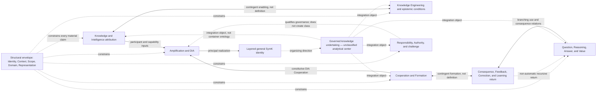

# SymK 2.1.9B — Dependency, Reciprocity, Circularity, and Structural Integrity

**Status:** Analytical working result — no decision authority
**Date:** 22 August 2026
**Working baseline:** `2.1-dev.66`
**Authority:** 2.1.9 opening control `SYMK-2X-EV-149`–`150`; Stream A evidence `SYMK-2X-EV-151`; project-steward continuation instruction “go ahead”, recorded with this analysis as `SYMK-2X-EV-152`
**Decision target:** Future Proposed `SYMK-2X-DR-018`; reserved without proposal content or status
**Candidate baseline target:** `2.1-rc.1`; not created
**Depends on:** Stage-Accepted `SYMK-2X-DR-009` through `SYMK-2X-DR-017` and the non-authoritative Stream A normalized inventory

## 1. Question and analytical result

> Can the accepted DR-009–017 concept system be represented as a typed dependency graph without circular definition, self-validation, hidden primitives, property transfer, unacknowledged Bearers or objects, Scope/Context/Domain leakage, or a graph that silently becomes the final Ontology?

Stream B supports the following working answer:

> **Yes, provisionally. The accepted system admits a structurally coherent typed analytical graph when definitional or constitutive dependency is kept separate from enabling, constraining, evidentiary, causal, governance, lifecycle, representational, realization, qualification, lineage, return, and prohibited-entailment relations. The graph contains legitimate reciprocal and recursive paths, but none of the accepted Foundational concepts must be defined solely by a cycle.**

> **Eight material reciprocal, recursive, or potentially circular patterns are present: Knowledge–Intelligence reciprocity; the Knowledge Engineering epistemic lifecycle; Cooperation–Formation reciprocity; the Feedback/Correction/Learning lifecycle; the Question-to-consequence return; Responsibility/challenge/correction governance return; DIA/Amplification/capability revalidation; and the general-framework/governed-undertaking integration loop. Seven are safe under accepted direction, time, Evidence, external-anchor, and non-entailment controls. The eighth potential loop—general SymK framework ↔ governed knowledge undertaking ↔ governed components—remains unresolved because “governed knowledge undertaking” is an accepted organizing-center direction but not an independently disposed concept, System class, or package. It may remain an analytical integration object, but it cannot define the framework that in turn defines it.**

> **No irreparable contradiction among DR-009–017 is established. Two high-priority semantic gaps remain for Stream C and later review: Capability requires a cross-package typed carrier without being promoted into a new concept, and the governed knowledge undertaking requires identity, boundary, and relation tests before it can appear in the integrated baseline. The common claim/assessment/status/record pattern and the relation-kind vocabulary are usable as analytical graph infrastructure only; they do not acquire concept or package status.**

Stream B therefore passes provisionally to separately instructed Stream C. It creates no canonical graph, Ontology, package, formal language, new disposition, reopened decision, DR-018 content, or `2.1-rc.1` baseline.

## 2. Graph status and interpretation rule

This record is an analytical Representation. Its node and edge identifiers are local to Stream B and have no canonical, semantic-package, constitutional, or runtime authority.

An arrow means only the relation named on that edge. It never means generic dependence, causal production, temporal precedence, logical implication, normative priority, System membership, data flow, implementation call, or class inheritance unless that exact relation is stated.

The exact accepted decision objects govern over this graph. If a compact node groups several accepted distinctions, the grouping is navigational rather than ontological. If a later test exposes a materially different relation, the edge must be revised or split; the accepted source must not be rewritten to fit the graph.

## 3. Graph record envelopes

### 3.1 Node envelope

Every material node must preserve:

| Field | Required content |
|---|---|
| local node identity | Stream-local identifier, label, version, and source decision |
| status class | Foundational; governed supporting/compound; imported; Engineering Representation/Projection; historical/identity direction; analytical carrier; excluded; or deferred |
| semantic object | What the node denotes and what it explicitly does not denote |
| Bearer or object rule | Adequate subject, bearer, object, role, or level where the predicate requires one |
| Context / Scope / Domain | Relevant interpretive conditions, declared boundary, and competent specialization jurisdiction |
| time and lifecycle | Event, state, interval, version, persistence, succession, or revalidation condition where material |
| authority and Evidence | Source of semantic, assessment, governance, Domain, or external authority and the evidence required for actual claims |
| challenge path | Dissent, counterevidence, review, correction, reopening, or external-authority route |
| representation boundary | Applicable View, artifact, Projection, transformation, uncertainty, and declared loss |

### 3.2 Edge envelope

Every material edge must preserve:

| Field | Required content |
|---|---|
| source and target | Stable node identities; no unnamed “system,” “actor,” “thing,” or “result” |
| relation kind | One code from the working relation vocabulary below |
| direction | Source-to-target meaning; reciprocal paths require two separately justified edges |
| modality | Constitutive, necessary, contingent, possible, prohibited, historical, or unresolved |
| predicate object and level | What relation holds, for which subject/object, and at which explanatory level |
| Context / Scope / Domain / time | Material qualifiers and change conditions |
| accepted source | Exact DR clause or accepted family supporting the edge |
| Evidence / authority / status | What supports a claim that the edge holds in an actual case and who may assess or govern it |
| challenge and failure | Counterevidence, defeater, dissent, reopening route, and effect of edge failure |
| non-entailments | Properties, roles, statuses, adjacent relations, or implementation claims that do not transfer through the edge |

Concept-level edges in this record state semantic possibility or requirement. They do not assert that an edge holds for an actual project, System, person, organization, Question, Answer, or event.

## 4. Working relation-kind vocabulary

| Code | Relation kind | Directional meaning | What it must not imply |
|---|---|---|---|
| `CON` | constitutive condition | Target instance requires the stated source condition or role as part of its accepted meaning | Causal production, moral legitimacy, permanence, or actual satisfaction |
| `NEC` | necessary interpretive dependency | Target cannot be interpreted adequately without the source distinction | Class membership, temporal priority, or sufficient condition |
| `SPC` | specialization/class relation | Source is a governed narrower kind or qualification of target | Exhaustiveness, inheritance of every predicate, or actual instance membership |
| `ATT` | attribution/Bearer relation | Predicate is borne by or attributed to the identified target under criteria | Property transfer, truth, assessment acceptance, or record identity |
| `CMP` | comparison relation | Source claim compares target states, alternatives, baselines, or profiles | Scalar aggregation, equivalence, causality, or value |
| `ENB` | contingent enabling relation | Source may make target possible, easier, more capable, or available | Necessity, sufficiency, definition, automatic occurrence, or benefit |
| `CNS` | constraining relation | Source bounds, qualifies, limits, conditions, or defeats target interpretation/use | Constitution of the target or universal prohibition |
| `CAU` | causal-contribution relation | Source makes a model-relative difference to target under stated assumptions | Agency, Authority, Responsibility, necessity, or complete explanation |
| `EVD` | evidentiary-support relation | Source bears a contextual evidentiary role toward a claim or assessment target | Truth, Knowledge, intrinsic evidence, sufficiency, or status |
| `ASM` | assessment relation | Source evaluates target under criteria, method, Evidence, authority, and uncertainty | Actual predicate, truth, Authority outside Scope, or finality |
| `GOV` | governance relation | Source authorizes, constrains, assigns, reviews, challenges, or routes target under applicable authority | Epistemic truth, capability, moral legitimacy, or actual execution |
| `QLF` | qualification relation | Source adds a declared condition or profile to target without replacing it | New substance, independent foundation, automatic status, or equivalence |
| `REP` | representation relation | Source makes selected aspects of target available in a form | Identity with target, semantic completeness, truth, or authority |
| `PRJ` | Projection/transformation relation | Source maps selected target dimensions with transformations, omissions, additions, and loss | Equivalence, source replacement, or silent strengthening |
| `TMP` | temporal/lifecycle relation | Source precedes, succeeds, persists, revises, replaces, suspends, or revalidates target | Identity continuity, improvement, Learning, or inheritance by name |
| `RET` | recursive governance return | Source returns observations, Evidence, challenge, or consequence to a prior governing object | Automatic correction, policy, semantic change, constitutional change, or promotion |
| `REA` | realization relation | Source is a principal, possible, or concrete realization of target direction | Exhaustiveness, equivalence, universal requirement, or final architecture |
| `LIN` | historical/decision lineage | Source precedes, is preserved by, deepens, or is superseded in a bounded respect by target | Erasure, semantic identity, automatic invalidity, or temporal causality |
| `NON` | prohibited entailment | Source does not by itself entail or transfer the target predicate | Impossibility of a separately evidenced target relation |

These nineteen kinds are sufficient for Stream B. They are not a final relation taxonomy. Stream C may split a kind where cross-cluster testing shows material ambiguity; 2.5 and 2.9 own final package and formal relation realization.

## 5. Node inventory

### 5.1 Stage-Accepted Foundational nodes

| Node | Label | Kind and source | Bearer/object control |
|---|---|---|---|
| `B-F01` | Identity | Foundational, DR-010 | Governed subject whose continuity is at issue; identifier or name is insufficient |
| `B-F02` | Context | Foundational, DR-010 | Conditions relevant to a declared interpretation, assessment, attribution, or use |
| `B-F03` | Scope | Foundational, DR-010 | Boundary of a declared predicate, validity, attribution, Authority, or Responsibility |
| `B-F04` | Domain | Foundational, DR-010 | Bounded field of inquiry/practice and its competent specialization authority |
| `B-F05` | Representation | Foundational, DR-010/012 | Represented subject and form remain non-identical |
| `B-F06` | Knowledge | Foundational, DR-011 | Predicate-specific Knowledge Bearer; claim, document, asset, status, and reliance remain separate |
| `B-F07` | Intelligence | Foundational, DR-011 | Identified organized Bearer and actual multidimensional capacity |
| `B-F08` | Knowledge Engineering | Foundational, DR-012 | Engineering activity/discipline and direct object are distinct; truth or Knowledge is not its product by definition |
| `B-F09` | Cooperation | Foundational, DR-013 | Actual relational occurrence among distinguishable Participants at supportable levels |
| `B-F10` | Formation | Foundational, DR-013 | Identified subject of developmental shaping; Learner only for Learning claims |
| `B-F11` | Responsibility | Foundational, DR-014 | Identified subject, object, source, frame, phase, standard, and response relation |
| `B-F12` | Amplification | Foundational relationship, DR-015 | Same identified amplified Bearer across a materially comparable capability relation |
| `B-F13` | Domain Intelligence Amplifier | Foundational specific System class, DR-015 | Identified organized System assessed against all seven conditions; not necessarily amplified or Intelligent at whole level |
| `B-F14` | Question | Foundational, DR-016 | Inquiry object and answer obligation; wording, prompt, task, query, frame, and record remain separate |
| `B-F15` | Reasoning | Foundational, DR-016 | Identified reasoner or organized arrangement and episode level |
| `B-F16` | Answer | Foundational relational concept, DR-016 | Content-to-Question relation; source, occurrence, Representation, use, and record remain separate |
| `B-F17` | Value | Foundational relational concept, DR-016 | Evaluated object/state/change/alternative plus claimants, beneficiaries, affected subjects, criteria, authority, horizon, and distribution |

### 5.2 Supporting, identity, and analytical graph nodes

| Node | Label | Status | Graph use and boundary |
|---|---|---|---|
| `B-S01` | Relationship | Governed supporting, DR-010 | Requires typed meaning; never a bare technical edge |
| `B-S02` | Applicability | Governed supporting, DR-010 | Relates subject and Context under Scope and criteria |
| `B-S03` | Bearer | Governed supporting, DR-010/011 | Predicate-relative attribution role; never a universal actor or owner |
| `B-S04` | Projection | Governed supporting, DR-010/012 | Source-to-Representation mapping with declared loss |
| `B-S05` | System | Imported support, DR-010 | Organized whole with justified boundary and organization |
| `B-S06` | Entity | Engineering/reference-model candidate, DR-010 | Graph convenience only; not a universal semantic parent |
| `B-S07` | Epistemic Condition and lifecycle | Governed supporting system, DR-012 | Direct Knowledge Engineering object and recursive epistemic relations |
| `B-S08` | Attribution | Governed supporting relationship family, DR-011 | Separates actual bearing, claim, assessment, status, and record |
| `B-S09` | Claim | Analytical cross-package carrier grounded in accepted claim families | Assertion about a predicate; not the actual predicate |
| `B-S10` | Assessment | Analytical cross-package carrier grounded in accepted assessment families | Evidence-bearing evaluation; not truth or actual bearing |
| `B-S11` | Status | Analytical typed carrier grounded in accepted status families | Regime-specific designation; type and authority mandatory |
| `B-S12` | Record | Engineering Representation pattern | Durable representation of identified claims, relations, events, decisions, assessments, or statuses |
| `B-S13` | Ground/Evidence/Provenance system | Governed supporting system, DR-012 | Contextual support, origin, transformation, counterevidence, and challenge; no intrinsic force |
| `B-S14` | Three-View alignment system | Governed supporting system, DR-012 | Human, Scientific, Engineering Views; cross-view capabilities, transformations, uncertainty, and loss |
| `B-S15` | Capability family | Analytical carrier only | Keeps Intelligence, Agency, effective capability, professional capability, retention, and Learning-related changes typed without admitting a new concept |
| `B-S16` | Cooperation roles and shared undertaking | Governed supporting system, DR-013 | Participant, Contribution, mutual orientation, shared undertaking, unit, episode, continuing relation, and adjacent-role controls |
| `B-S17` | Responsibility governance system | Governed supporting system, DR-014 | Agency, causation, Control, role, Authority, Authorization, allocation, standing, consent-integrity, challenge, response, and ethical compatibility |
| `B-S18` | Amplified Intelligence | Governed compound, DR-015 | Intelligence of the same Bearer qualified by valid Amplification |
| `B-S19` | Complex Question | Governed supporting qualification, DR-016 | Scoped relational complexity of a Question; no label or threshold shortcut |
| `B-S20` | Quality/time/cost/constrained-Value profiles | Governed compound/supporting system, DR-016 | Profiles preserve object, dimensions, Evidence, assessors, authority, uncertainty, distribution, and loss |
| `B-S21` | Feedback/Uptake/Correction/Learning return | Governed supporting recursive system, DR-013/016 | Non-automatic consequence and evidence return across versions and levels |
| `B-S22` | General SymK identity direction | Stage-Accepted identity proposition, DR-017 | Engineering discipline and general framework for responsible Knowledge Engineering; not a new concept |
| `B-S23` | Governed knowledge undertaking | Unclassified Stage-Accepted organizing-center label, DR-017 | Analytical integration object only; not yet System, DIA, shared undertaking, workflow, legal object, Bearer, or Foundational concept |
| `B-S24` | Product Vision branching value chain | Accepted orientation represented through DR-016/017 | Non-linear, non-deterministic, defeasible, recursive analytical spine |
| `B-S25` | Historical Symbiotic Cooperation Protocol | Historical lineage, DR-017 | Preserved origin and possible derived specialization; not universal topology |
| `B-S26` | Time/version/lifecycle qualifier | Analytical carrier grounded across DR-010–016 | Event/state/version/persistence/succession/revalidation field; not a new concept |
| `B-S27` | Authority/challenge route | Governed supporting integration pattern | Keeps source, jurisdiction, notice, access, review, response, correction, appeal, and reopening explicit |
| `B-S28` | Affected-subject/consequence horizon | Governed supporting integration pattern | Prevents Participant, user, beneficiary, decision authority, or responsible-subject substitution |
| `B-S29` | Purpose/criterion/standard/materiality carrier | Analytical carrier | Requires competent source and Domain; prevents hidden objectives and thresholds |
| `B-S30` | Organization/Integration/dependency/level system | Analytical carrier grounded in DR-011/013/015 | Preserves boundary, organization, mechanism, provider, alternative, effect, lowest adequate level, and revalidation |

The graph therefore contains forty-seven declared nodes: seventeen Stage-Accepted Foundational nodes and thirty supporting, identity, historical, imported, Engineering, or analytical nodes. This is a graph inventory count, not a concept or package count.

## 6. High-level cluster graph

The diagram is a navigation aid. It deliberately omits many edges and uses dotted lines for analytical or constraining relations. The edge register below governs interpretation.

## 7. Typed material edge register

All edges inherit the node and edge envelopes in Section 3. “Contingent” means possible under separately evidenced conditions; it never means universal occurrence.

### 7.1 Structural and representational edges

| Edge | Source | Kind | Target | Modality and guard | Accepted basis |
|---|---|---|---|---|---|
| `B-E001` | `B-F01` Identity | `NEC` | every material node/edge | Necessary interpretive control; criteria and bearer/object declared | DR-010 |
| `B-E002` | `B-F02` Context | `CNS` | every material application/assessment | Conditions explicit; not Scope or truth | DR-010 |
| `B-E003` | `B-F03` Scope | `CNS` | every material predicate/authority edge | Boundary and object explicit; no silent expansion | DR-010 |
| `B-E004` | `B-F04` Domain | `CNS` | specialization and external-authority edges | Universal minimum/project specialization separated | DR-010/009 |
| `B-E005` | `B-F05` Representation | `REP` | represented subject | Source/target identity, View, transformation, uncertainty, and loss explicit | DR-010/012 |
| `B-E006` | `B-S04` Projection | `PRJ` | `B-F05` Representation | Source dimensions, additions, omissions, method, authority, reversibility, and loss explicit | DR-010/012 |
| `B-E007` | `B-S02` Applicability | `ASM` | subject-in-Context | Criteria, Scope, assessor, Evidence, and status separate | DR-010 |
| `B-E008` | `B-S03` Bearer | `ATT` | actual predicate claim | Predicate-specific subject/level; no source/owner/authority/responsibility transfer | DR-010/011 |
| `B-E009` | `B-S14` View system | `QLF` | `B-F05` Representation | Human/Scientific/Engineering meaning and capabilities preserved | DR-012 |
| `B-E010` | `B-S06` Entity | `NON` | universal semantic parent | Engineering convenience cannot become foundational by graph use | DR-010 |

### 7.2 Knowledge, Intelligence, and epistemic-condition edges

| Edge | Source | Kind | Target | Modality and guard | Accepted basis |
|---|---|---|---|---|---|
| `B-E011` | `B-F06` Knowledge | `ATT` | `B-S03` Bearer | Actual claim requires predicate-specific epistemic criteria | DR-011 |
| `B-E012` | `B-F07` Intelligence | `ATT` | `B-S03` Bearer | Actual multidimensional capacity at lowest adequate organized level | DR-011 |
| `B-E013` | `B-F07` Intelligence | `QLF` | `B-S15` capability configuration | Intelligence is capacity, not profile or score; dimensions remain open | DR-011 |
| `B-E014` | attributed capability profile | `REP` | actual capability configuration | Evidence, time, uncertainty, challenge, and assessor explicit | DR-011 |
| `B-E015` | score/class/ranking/general factor | `PRJ` | attributed capability profile | Purpose-specific reduction with loss; no capability creation | DR-011 |
| `B-E016` | `B-F06` Knowledge | `ENB` | `B-F07` Intelligence | Contingent enabling/constraining/developmental relation, not definition | DR-011 |
| `B-E017` | `B-F07` Intelligence | `ENB` | `B-F06` Knowledge | Contingent inquiry/interpretation/formation relation, not definition | DR-011 |
| `B-E018` | `B-F06` Knowledge | `NON` | `B-F07` Intelligence | No automatic cross-attribution | DR-011 |
| `B-E019` | `B-F07` Intelligence | `NON` | `B-F06` Knowledge | No automatic cross-attribution | DR-011 |
| `B-E020` | `B-F08` Knowledge Engineering | `CON` | `B-S07` Epistemic Condition | Epistemic conditions are the direct engineered object | DR-012 |
| `B-E021` | `B-S07` Epistemic Condition | `ENB` | `B-F06` Knowledge | Conditions may support achievement but never guarantee it | DR-012 |
| `B-E022` | `B-F08` Knowledge Engineering | `NON` | `B-F06` Knowledge | Engineering does not manufacture truth or Knowledge | DR-012 |
| `B-E023` | `B-S09` Claim | `REP` | claimed epistemic content/predicate | Claim is expressed in Representation and remains distinct from actuality | DR-012 and later DRs |
| `B-E024` | `B-S13` Ground/Evidence/Provenance | `EVD` | `B-S09` Claim | Contextual support under method and challenge; no intrinsic force | DR-012 |
| `B-E025` | `B-S10` Assessment | `ASM` | `B-S09` Claim or predicate | Evidence-bearing evaluation; truth and actual bearing remain separate | DR-012 and later DRs |
| `B-E026` | `B-S11` Status | `GOV` | claim/assessment/use | Regime and issuing authority explicit; status does not create truth | DR-012 and later DRs |
| `B-E027` | Reliance Authorization | `GOV` | use of claim/Answer | Scoped decision relation; Knowledge, warrant, and Responsibility remain separate | DR-012/014/016 |
| `B-E028` | `B-S12` Record | `REP` | claim/assessment/status/event | Durable lineage only; record does not create represented state | DR-012 and later DRs |

### 7.3 Cooperation, Formation, and recursive-development edges

| Edge | Source | Kind | Target | Modality and guard | Accepted basis |
|---|---|---|---|---|---|
| `B-E029` | distinguishable Participants | `CON` | `B-F09` Cooperation | At least two supportable Participant roles at their own levels | DR-013 |
| `B-E030` | material Contributions | `CON` | `B-F09` Cooperation | Contribution type and connection to undertaking evidenced | DR-013 |
| `B-E031` | mutual orientation/shared undertaking | `CON` | `B-F09` Cooperation | Sufficient reciprocal relation; agreement and symmetry unnecessary | DR-013 |
| `B-E032` | coordination/communication/aggregation/compliance/consensus | `NON` | `B-F09` Cooperation | Adjacent relation or status is insufficient | DR-013 |
| `B-E033` | `B-F09` Cooperation | `NON` | `B-F11` Responsibility | Cooperative occurrence does not allocate Responsibility | DR-013/014 |
| `B-E034` | `B-F09` Cooperation | `NON` | `B-F17` Value | Occurrence does not establish benefit, legitimacy, or success | DR-013/016 |
| `B-E035` | `B-F10` Formation | `ATT` | identified formative subject | Condition/activity/effect/achievement/status/record separately evidenced | DR-013 |
| `B-E036` | Learning | `SPC` | developmental change within `B-F10` Formation | Stable Learner, durability, experience link, variation, and alternatives required | DR-013/016 |
| `B-E037` | Feedback | `ENB` | Uptake | Return may be unavailable, ignored, rejected, or distorted | DR-013/016 |
| `B-E038` | Uptake | `ENB` | Correction | Use or integration does not entail corrected state | DR-013/016 |
| `B-E039` | Correction | `ENB` | Learning | Changed state and experience may contribute; no automatic durability or improvement | DR-013/016 |
| `B-E040` | `B-F09` Cooperation | `ENB` | `B-F10` Formation | Participation may shape subjects; effect requires Evidence and time | DR-013 |
| `B-E041` | `B-F10` Formation | `ENB` | `B-F09` Cooperation | Capacities/dispositions may condition later Cooperation; not necessary by definition | DR-013 |
| `B-E042` | member/component Learning | `NON` | System Learning | Whole-level integration and stable boundary require separate Evidence | DR-013/016 |
| `B-E043` | trace/storage/retrieval/update/replacement | `NON` | memory or Learning | Representation and change mechanisms do not establish the predicate | DR-013/016 |

### 7.4 Responsibility, Authority, and challenge edges

| Edge | Source | Kind | Target | Modality and guard | Accepted basis |
|---|---|---|---|---|---|
| `B-E044` | `B-F11` Responsibility | `ATT` | responsible subject | Object, source, frame, phase, standard, response, and level explicit | DR-014 |
| `B-E045` | governing source/frame/standard | `CON` | `B-F11` Responsibility relation | Source validity and jurisdiction remain challengeable | DR-014 |
| `B-E046` | Agency | `QLF` | `B-S15` capability | Scoped organized-subject selection/control capability; no moral/legal inference | DR-014 |
| `B-E047` | action | `ATT` | exercise of Agency | Target and Scope explicit; execution/output alone insufficient | DR-014 |
| `B-E048` | causal Contribution | `CAU` | event/condition/outcome/consequence | Model-relative level-qualified difference; no normative inference | DR-014 |
| `B-E049` | Authority | `GOV` | governance act/decision/review | Source, jurisdiction, type, object, Scope, time, validity, legitimacy, and effect separate | DR-014 |
| `B-E050` | Authority | `ENB` | Authorization | Applicable source may confer permission or mandate; not actual exercise | DR-014 |
| `B-E051` | Authorization | `GOV` | act/use/role/resource | Scoped permission/status; no truth, consent, occurrence, or Responsibility | DR-014 |
| `B-E052` | Agency/control/causal Contribution | `NON` | `B-F11` Responsibility | Factual capacity or contribution is insufficient | DR-014 |
| `B-E053` | Authority/Authorization/role | `NON` | `B-F11` Responsibility | Governance relation is insufficient without applicable Responsibility source/object | DR-014 |
| `B-E054` | `B-F11` Responsibility | `NON` | blame/liability/remedy | Framework-specific assessment or response needs separate authority | DR-014 |
| `B-E055` | Responsibility allocation | `GOV` | multiple object-specific relations | Typed, non-additive, multi-level, temporal; no universal residual bearer | DR-014 |
| `B-E056` | affected-subject standing | `ENB` | challenge/response route | Eligibility does not create veto, legal standing, Participation, or remedy | DR-014 |
| `B-E057` | ethical compatibility | `QLF` | Responsibility/arrangement/operation | Seven-commitment SymK compatibility boundary; not complete ethics | DR-014 |
| `B-E058` | matrix/score/workflow/audit/record | `NON` | actual Responsibility/Authority | Engineering artifact cannot manufacture or transfer relation | DR-014 |

### 7.5 Amplification and DIA edges

| Edge | Source | Kind | Target | Modality and guard | Accepted basis |
|---|---|---|---|---|---|
| `B-E059` | `B-F12` Amplification | `ATT` | identified amplified Bearer | Same-Bearer Identity or declared new-System counterfactual; level explicit | DR-015 |
| `B-E060` | `B-F12` Amplification | `CMP` | baseline and relevant effective capability | Comparable resources/support/variation/time; gains, losses, unchanged, unknown visible | DR-015 |
| `B-E061` | intervention/organized arrangement | `CAU` | capability change in Amplification | Material causal Contribution evidenced; assistance or output alone insufficient | DR-015 |
| `B-E062` | `B-S18` Amplified Intelligence | `QLF` | `B-F07` Intelligence | Same identified Bearer; not a substance or DIA synonym | DR-015 |
| `B-E063` | valid `B-F12` Amplification | `CON` | `B-S18` Amplified Intelligence | Amplification of that Bearer's relevant Intelligence required | DR-015 |
| `B-E064` | `B-F13` DIA | `SPC` | `B-S05` System | Foundational specific organized-System class using imported System support | DR-015 |
| `B-E065` | Domain purpose/Complex-Question orientation | `CON` | `B-F13` DIA | Declared purpose and question class; Domain criteria retained | DR-015 |
| `B-E066` | plural qualified Intelligence Participants | `CON` | `B-F13` DIA | Each Intelligence and Participation claim separately evidenced | DR-015 |
| `B-E067` | actual `B-F09` Cooperation | `CON` | `B-F13` DIA | Connection, orchestration, workflow, or shared output insufficient | DR-015 |
| `B-E068` | governed Domain `B-F06` Knowledge | `CON` | `B-F13` DIA | Claims, Grounds, Evidence, status, challenge, reliance, and revision governed | DR-015 |
| `B-E069` | explicit amplified-Bearer/capability target | `CON` | `B-F13` DIA | Target may differ from DIA System and participants | DR-015 |
| `B-E070` | evidenced repeatable `B-F12` Amplification support | `CON` | `B-F13` DIA | Relevant variation and lifecycle required; one success insufficient | DR-015 |
| `B-E071` | `B-F13` DIA | `NON` | whole-System `B-F07` Intelligence | DIA membership alone does not establish whole-level Intelligence | DR-015 |
| `B-E072` | `B-F13` DIA | `NON` | amplified Bearer identity | DIA System need not be the amplified Bearer | DR-015 |
| `B-E073` | responsible Amplification/SymK compatibility | `QLF` | descriptive Amplification or DIA membership | Responsibility, Authority, affected consequences, and later constitutional force remain separate | DR-015/014 |
| `B-E074` | dependency/provider/Integration system | `CNS` | DIA capability and lifecycle | Membership, control, fragility, lock-in, cost, Responsibility, and alternatives separately assessed | DR-015 |
| `B-E075` | material lifecycle change | `TMP` | DIA identity/membership/qualification | Revalidation required; name, legal entity, certificate, or prior status insufficient | DR-015 |

### 7.6 Question, Reasoning, Answer, Value, and return edges

| Edge | Source | Kind | Target | Modality and guard | Accepted basis |
|---|---|---|---|---|---|
| `B-E076` | Domain subject/purpose/answer obligation | `CNS` | `B-F14` Question | Frame, assumptions, affected horizon, uncertainty, and version explicit | DR-016 |
| `B-E077` | `B-S19` Complex Question | `QLF` | `B-F14` Question | Relational complexity under Evidence; no length, difficulty, AI, or DIA shortcut | DR-016 |
| `B-E078` | `B-F14` Question | `ENB` | inquiry and `B-F15` Reasoning | May orient processes; does not guarantee occurrence or adequacy | DR-016 |
| `B-E079` | `B-F14` Question | `NON` | `B-F15` Reasoning | A Question does not establish a Reasoning episode or capability | DR-016 |
| `B-E080` | `B-F15` Reasoning | `ATT` | reasoner/organized arrangement | Episode, level, considerations, process Evidence, assessment, and trace separated | DR-016 |
| `B-E081` | `B-F15` Reasoning | `ENB` | `B-F16` Answer | May contribute to content satisfying an obligation; no guarantee | DR-016 |
| `B-E082` | `B-F15` Reasoning | `NON` | `B-F16` Answer | Reasoning may yield no conclusion; Answer may rely on other paths | DR-016 |
| `B-E083` | Question correspondence/answer obligation | `CON` | `B-F16` Answer | Identified Question version, coverage, conditions, qualifications, and lineage required | DR-016 |
| `B-E084` | `B-F16` Answer | `NON` | Knowledge/quality/Authority/decision/outcome | Each adjacent predicate requires its own relation and Evidence | DR-016/011/014 |
| `B-E085` | Answer-Quality profile | `ASM` | `B-F16` Answer relative to `B-F14` Question | Dimensions, Evidence, assessor, uncertainty, distribution, non-compensation, and use explicit | DR-016 |
| `B-E086` | temporal profile | `CMP` | response/inquiry/verification/decision/action/correction intervals | Comparable start/end events and obligations required | DR-016 |
| `B-E087` | total-cost profile | `ASM` | cost objects and cost Bearers | Bounded material completeness, transfer, externalization, distribution, uncertainty, and exclusions explicit | DR-016 |
| `B-E088` | `B-F17` Value | `ASM` | object/state/change/alternative | Claimants, beneficiaries, affected subjects, criteria, authority, counterfactual, horizon, and distribution explicit | DR-016 |
| `B-E089` | `B-F16` Answer | `ENB` | `B-F17` Value | Answer may contribute to value for a use; never entails it | DR-016 |
| `B-E090` | outcome/consequence | `ENB` | Value reassessment | Effects may change evaluation; causal and evaluative relations remain separate | DR-016 |
| `B-E091` | favorable/adverse outcome | `NON` | Question/Reasoning/Answer validity or Value | Neither success nor failure validates or falsifies the chain automatically | DR-016 |
| `B-E092` | consequence/observation | `ENB` | Feedback | Return requires detection, relation to object, transmission, and receiver | DR-016 |
| `B-E093` | Feedback | `EVD` | claim/assessment only when qualified | Ground, integrity, relevance, uncertainty, and competent evaluation required | DR-016/012 |
| `B-E094` | `B-S21` return system | `RET` | validation/Responsibility/policy/concept/Constitution | Non-automatic governance return with competent authority and lineage | DR-016 |
| `B-E095` | update/behavior/capability change | `NON` | Learning or improvement | Stable Learner, durability, experience link, relevant variation, alternatives, and Value separately required | DR-013/016 |

### 7.7 Layered-identity and organizing-center edges

| Edge | Source | Kind | Target | Modality and guard | Accepted basis |
|---|---|---|---|---|---|
| `B-E096` | `B-S25` historical protocol | `LIN` | `B-S22` general SymK identity | Preserved origin and possible specialization; fixed dyad not universal | DR-017 |
| `B-E097` | accepted 2.0 DIA orientation | `LIN` | `B-S22` general SymK identity | Deepened rather than erased; exact canonical wording still pending review | DR-017 |
| `B-E098` | `B-F13` DIA | `REA` | `B-S22` general SymK identity | Principal realization and central objective, not exhaustive identity | DR-017 |
| `B-E099` | `B-F13` DIA | `NON` | exhaustive SymK-governed undertaking set | SymK distinctions may govern legitimate non-DIA undertakings | DR-017 |
| `B-E100` | `B-S22` general SymK identity | `GOV` | `B-S23` governed knowledge undertaking | Organizing direction only; not yet a class or concept definition | DR-017 |
| `B-E101` | `B-S23` governed knowledge undertaking | `CNS` | integrated use of Question/epistemic/Cooperation/Responsibility/Value/return systems | Analytical center must expose relations without containing or redefining them | DR-017 |
| `B-E102` | `B-S23` governed knowledge undertaking | `NON` | System/DIA/Bearer/actor/workflow/project/legal object | No automatic identity with adjacent object classes | DR-017 |
| `B-E103` | attributional Copernican correction | `CNS` | Intelligence attribution | Human resemblance, origin, substrate, or role label cannot select the reference standard | DR-017/011 |
| `B-E104` | Knowledge Engineering Copernican correction | `CNS` | organizing-center selection | No isolated Human, AI, institution, model, component, System, graph, or workflow is sovereign by type | DR-017 |
| `B-E105` | bounded jurisdiction | `CNS` | `B-S22` general SymK identity | Framework cannot expand into all epistemology, science, Intelligence, ethics, law, governance, education, or social order | DR-017 |
| `B-E106` | Human/Authority/Responsibility anti-erasure | `CNS` | `B-S23` governed knowledge undertaking | De-centering preserves distinct subjects, standing, external Authority, and independent Responsibility | DR-017 |
| `B-E107` | `B-S24` Product Vision chain | `REP` | `B-S22` general SymK identity and principal realization | Branching, defeasible, recursive, non-scalar, non-exhaustive; canonical revision deferred | DR-016/017 |

The register contains 107 typed material edges. Several rows use a governed family as source or target to avoid pretending that a final package or Ontology already exists. Every such family remains decomposable into the exact accepted distinctions during Stream C and final package work.

## 8. Reciprocity and circularity audit

| Pattern | Cycle path | Type | External anchors that break circular definition | Result |
|---|---|---|---|---|
| Knowledge–Intelligence | Knowledge → enables Intelligence → enables Knowledge | Reciprocal enabling/developmental, not definitional | Independent DR-011 definitions, predicate-specific Bearers, Evidence, actual capability, epistemic achievement, no-cross-entailment edges | Pass |
| Knowledge Engineering lifecycle | KE → Epistemic Conditions → claims/Evidence/assessment/reliance/consequence → revised conditions | Recursive engineering and evidentiary lifecycle | External Domain objects, actual consequences, competent Evidence/assessment authority, versioning, challenge; KE does not manufacture Knowledge | Pass |
| Cooperation–Formation | Cooperation → may form Participants; Formation → may condition later Cooperation | Contingent developmental reciprocity | Independently accepted nuclei, identified subjects, episodes, time, mechanism, effect Evidence, non-necessity | Pass |
| Feedback–Correction–Learning | consequence/signal → Feedback → possible Uptake → possible Correction → possible Learning → changed capability/behavior → later consequence | Temporal lifecycle recursion | Stable Learner, versioned events, separate Evidence at every transition, competing explanations, no improvement entailment | Pass |
| Question-to-consequence return | Question → possible Reasoning → possible Answer → decision/action/use → outcome/consequence → Feedback → possible Question revision | Branching governance/epistemic lifecycle | Question versions, non-automatic edges, independent Authority/Responsibility/Value, causal Evidence, affected horizon, historical lineage | Pass |
| Responsibility/challenge/correction | sourced Responsibility → answerability/challenge → assessment/response → correction/repair/reallocation → revised Responsibility state | Governance recursion | Independent governing source, jurisdiction, claimant/forum, Evidence, decision Authority, appeal/reopening, no self-authorization | Pass |
| DIA/Amplification revalidation | DIA conditions → repeatable Amplification support → capability evidence → lifecycle change → reassessment of DIA conditions | Class-evidence and lifecycle recursion | DIA class defined by seven conditions; Amplification independently defined; candidate/claim/assessment/status/record separated; time and counterevidence | Pass |
| General framework/governed undertaking | general identity → governed undertaking center → integrates concepts that explain the framework → general identity | Potential definitional/organizational circularity | DR-017 explicitly calls the undertaking a working label, but no independent identity/boundary/disposition yet exists | **Open high-risk blocker** |

No cycle may serve as its own Evidence. A later state may support reassessment of an earlier claim, but the return must identify new Evidence, changed Context, competent authority, version relation, and a challenge path.

## 9. Hidden-primitive audit

| Candidate hidden primitive | Why the graph uses it | Stream B treatment | Remaining risk/owner |
|---|---|---|---|
| Capability | Connects Intelligence, Agency, Amplification, professional transformation, retention, and Learning-related change | Analytical carrier `B-S15`; every use remains predicate-specific | Stream C tests coherence; DR-018 may decide whether a supporting disposition is needed; no promotion here |
| subject/object/arrangement | Needed to state attribution and relational predicates without universal Entity | Role-qualified local identities; no common ontological superclass assumed | 2.5 package model and 2.9 formal semantics |
| organization/integration | Selects adequate Intelligence/System/DIA/Learning levels and functional wholes | Analytical system `B-S30`; boundary, mechanism, effect, alternative, and Evidence mandatory | Stream C cases and 2.7 grounding |
| time/version/lifecycle | Makes reciprocity non-circular and stabilizes Identity, comparison, persistence, succession, and correction | Analytical qualifier `B-S26`; no new Time concept | Stream C/D/F and final formalization |
| relation kind | Prevents bare “depends on” from hiding meaning | Nineteen-kind working vocabulary | Stream C may split; 2.5/2.9 finalize |
| actual predicate | Required to separate reality from claim, assessment, status, and record | Node/edge envelope field, not a graph node or universal metaphysical commitment | Package/formal pattern later |
| claim/assessment/status/record | Repeated across every substantive cluster | Four analytical carriers grounded in accepted families; no common package implied | Stream D mapping and 2.5 construction |
| purpose/criterion/standard/materiality | Required by Question, Responsibility, Amplification, DIA, quality, cost, and Value | Analytical carrier `B-S29`; competent source and Domain mandatory | Stream C/E and external authority |
| authority/jurisdiction | Needed to distinguish semantic, assessment, governance, constitutional, Domain, legal, and operational acts | Typed Authority/challenge route; no authority laundering | Stream E constitutional/jurisdiction audit |
| causality/counterfactual | Needed by Amplification, outcome, consequence, cost, trade-off, and Responsibility interfaces | `CAU` and `CMP` kept distinct; Domain methods remain external | Stream C/E and grounding |
| evidence/relevance/uncertainty | Needed to assess every actual predicate and edge | DR-012 system retained; no intrinsic artifact evidence | Stream D/E and grounding |
| affected horizon | Needed by Question, Responsibility, Value, cost, outcome, and correction | Supporting integration node `B-S28`; not a universal stakeholder list | Stream C/E/F and external authority |
| change/improvement | Needed by Formation, Amplification, correction, Learning, and value chain | Predicate-specific temporal/change edges; improvement remains a Value assessment | Stream C/E |
| comparability/baseline | Needed by Amplification, quality, time, cost, Value, and outcome comparisons | `CMP` edge with object, bearer, resources, support, Context, time, variation, and uncertainty | Stream C/E and Domain methods |
| challengeability | Needed across semantic, epistemic, governance, project, and constitutional claims | Edge-envelope route; exact claimant, notice, access, protection, reception, response, and appeal typed | Stream E and later governance |

The audit exposes fifteen hidden-primitivity risks but finds no need to restore Entity as universal parent or promote any analytical carrier. Failure to keep a carrier typed would be an integration defect, not evidence that the carrier is automatically Foundational.

## 10. Bearer, object, and level audit

| Predicate or relation | Required bearer/object discipline | Prohibited level transfer | Result |
|---|---|---|---|
| Knowledge | Predicate-specific epistemic Bearer plus claim/Ground/Evidence/assessment distinction | document, repository, source, accepted status, or participant → Knowledge Bearer | Pass provisionally |
| Intelligence | Lowest adequate organized Bearer and actual multidimensional capacity | member/component/participant ↔ team/institution/configured System/profession | Pass provisionally |
| Cooperation | Participant roles with Contributions and mutual orientation; cooperative unit separately identified | connection, membership, resource, source, beneficiary, affected party, or whole configuration → Participant | Pass provisionally |
| Formation/Learning | Identified formative subject; stable Learner for Learning; level and competing explanation explicit | component/member change ↔ System Learning; update/replacement → Learning | Pass provisionally |
| Responsibility | Object-first sourced relation to identified subject and level; multiple relations may coexist | causal share, role, final approval, legal entity, Human presence, or System boundary → residual bearer | Pass provisionally |
| Agency/action/control | Organized subject and target-specific capacity/exercise/effect | output/execution/component operation → Agent or whole-level control | Pass provisionally |
| Authority/Authorization | Source, holder, jurisdiction, act/object, Scope, time, validity, legitimacy, effect | expertise/capability/access/title/record → Authority; Authority → Responsibility | Pass provisionally |
| Amplification | Same identified amplified Bearer across comparable states or declared new-System counterfactual | participant/component/provider/user/beneficiary/DIA System/predecessor/successor gain transfer | Pass provisionally |
| DIA | Identified organized System for class membership; each Participant, amplified Bearer, provider, Authority, and responsible subject independent | participant Intelligence → System Intelligence; DIA System → amplified Bearer or responsible subject | Pass provisionally |
| Reasoning | Identified Human/artificial/collective/institutional/distributed/hybrid arrangement and episode | contributor/tool/source/trace/output → reasoner; member process → whole process | Pass provisionally |
| Answer | Content-to-Question relation; source, author, contributor, responder, assessor, adopter, and user separate | source Authority/capability → Answer quality; output owner → Answer bearer | Pass provisionally |
| Value/cost/benefit/harm | Object plus claimants, beneficiaries, affected subjects, cost Bearers, authorities, horizons, and distributions | payer/provider/user/market/aggregate score → universal Value bearer or stakeholder set | Pass provisionally |
| Feedback/Correction | Object, sender/source, signal/consequence, receiver, assessor, correction authority, affected parties, and changed state explicit | signal receipt → Evidence/Uptake/Correction/Learning; “fixed” record → corrected state | Pass provisionally |
| governed knowledge undertaking | Identity and boundary unclassified; actors, artifacts, systems, institutions, and relations must remain visible | undertaking → System/Bearer/DIA/workflow/actor; center → semantic or moral sovereignty | **Open** |

No accepted property-transfer rule fails at concept level. Actual-case sufficiency remains a Domain, project, scientific, external-authority, or grounding question.

## 11. Scope, Context, Domain, and jurisdiction-leakage audit

| Leakage path | Required containment | Stream B result |
|---|---|---|
| project Ontology/Logic → universal SymK meaning | Project formalism may specialize or project but cannot redefine inherited concepts | Contained by `CNS`, `REP`, and `PRJ` edges |
| named Intelligence type or benchmark → universal Intelligence | Specialization authority, dimensions, Evidence, threshold, and loss remain explicit | Contained; no named type admitted |
| provider architecture/model label → System, Intelligence, Reasoning, DIA, or Answer status | Actual predicate and lowest adequate level require separate Evidence | Contained |
| scientific method/result → semantic or governance authority | Scientific View and Domain authority remain bounded; constitutional/external authority separate | Contained provisionally; Stream E owns full audit |
| legal/organizational status → Authority, Responsibility, ethics, or Knowledge | Applicable source and jurisdiction required; no automatic cross-regime status | Contained provisionally |
| Human readability/formal expression/machine inspectability → View identity | Capabilities cross Views; program lanes are separate again | Contained; Stream D re-tests mappings |
| DIA principal realization → exhaustive SymK identity | `REA` and `NON` edges preserve principal/non-exhaustive relation | Contained provisionally; Stream C stress-tests mission balance |
| broader framework → all Knowledge Engineering/epistemology/ethics/governance | DR-017 bounded-jurisdiction edge and external-authority routes | Contained provisionally; Stream E re-tests |
| Product Vision value claim → one objective/metric/optimizer | Quality, time, cost, Value, outcome, and trade-off edges remain plural and independently evidenced | Contained provisionally |
| canonical location/graph completeness → semantic or constitutional authority | Graph is analytical Representation and DR-018 remains uncreated | Contained |

No current Scope or Domain leak requires reopening an accepted decision. The Product Vision/general-framework boundary and exact constitutional jurisdiction remain active work for Streams C, E, and F.

## 12. Stream A blocker disposition after graph construction

| Stream A blocker | Stream B disposition | Next owner |
|---|---|---|
| governed-undertaking identity/boundary | Remains open and high-risk; usable only as unclassified analytical center | C tests necessity/non-substitution; F decides proposal route |
| Capability-family coherence | Partially controlled by analytical carrier and predicate-specific edges; no common concept admitted | C cross-cluster cases; possible DR-018 disposition only if necessary |
| claim/assessment/status/record interface | Controlled as graph infrastructure; not a concept/package | D View mapping; 2.5 package construction |
| dependency/relation typing | Working nineteen-kind vocabulary passes concept-level use | C stress test; 2.5/2.9 finalization |
| subject/level/organization/Bearer | No-transfer graph passes provisionally; actual thresholds remain open | C cases and 2.7 grounding |
| Product Vision/DIA/general-framework layering | No graph contradiction; canonical expression and value-chain integration remain open | C/F |
| responsible-* qualification architecture | Descriptive/qualified predicates separated by `QLF`/`GOV` edges | C/E |
| time/version/persistence/lifecycle | Controlled as required edge metadata; no new concept needed yet | C/D/F |
| View/capability/lane collision | Graph keeps them separate | D |
| Integration/Contribution homonyms | Qualified relation kinds and target levels prevent bare-edge use | C |
| final package/formalism absence | Not a concept-level blocker | 2.5/2.9 |
| genuine accepted-decision contradiction | None found; explicit conflict-classification route retained | C–F and DR-018 gate |

## 13. Mandatory cross-package counterexamples — Stream B lens

| Case | Graph result |
|---:|---|
| 1 | Separate Intelligence Bearer edges do not aggregate into whole-level Intelligence, Cooperation, or Reasoning. Pass. |
| 2 | Amplified-Bearer attribution is independent from DIA/System membership, Authority, and Responsibility edges. Pass. |
| 3 | Knowledge and Answer have no constitutive edge in either direction; an Answer-to-Knowledge relation requires separate epistemic achievement. Pass. |
| 4 | Contributor, Evidence source, Knowledge Bearer, reasoner, decision authority, and responsible subject are distinct nodes/roles. Pass. |
| 5 | Reasoning enables but does not entail Answer adequacy; Question version and answer obligation constrain correspondence. Pass. |
| 6 | Answer Quality assessment and Value assessment are separate edges with different objects, subjects, criteria, and authorities. Pass. |
| 7 | Outcome has `NON` edges to chain validity and only contingent/evidentiary return. Pass. |
| 8 | Feedback→Evidence/Uptake/Correction/Learning transitions are contingent and separately assessed. Pass. |
| 9 | Member Learning has a prohibited entailment to System Learning; replacement/update also has a prohibited entailment. Pass. |
| 10 | Cooperation has prohibited entailments to Responsibility and Value; Power, consent-integrity, Authority, and ethical qualification remain separate. Pass. |
| 11 | Governed undertaking has no constitutive DIA edge; non-DIA governed use remains possible. Pass provisionally; undertaking identity remains open. |
| 12 | Responsible/SymK-compatible DIA is a qualification edge separate from descriptive membership. Pass. |
| 13 | An Engineering View Projection that omits affected-subject relations fails the node/edge envelope and View-alignment edge. Detectable; Stream D owns full test. |
| 14 | Schema consistency cannot overcome wrong Scope, Domain, Bearer, or Question version because each is required graph metadata. Pass. |
| 15 | Project Ontology or metric remains a Projection/specialization and cannot redefine universal nodes. Pass. |
| 16 | Cooperation is process and has no edge making it final Value or purpose; candidate A0 conflict remains visible for Stream E. Pass provisionally. |
| 17 | Governed-undertaking usefulness does not create a Foundational disposition; graph can retain it as an analytical node. Pass. |
| 18 | No irreparable accepted-clause conflict is found. The graph includes an escalation route if Scope, Context, Domain, level, representation, or relation typing cannot repair a future conflict. Pass provisionally. |

## 14. Structural-integrity checks

| Check | Result | Limitation |
|---|---|---|
| all seventeen Foundational anchors represented | Pass | Graph nodes do not imply final package form |
| supporting/imported/identity infrastructure explicit | Pass | Grouped nodes remain decomposable into exact accepted distinctions |
| edge direction typed | Pass provisionally | Stream C may split relation kinds under counterexample pressure |
| reciprocity separated from definition | Pass | Governed-undertaking loop remains open |
| no cycle used as its own Evidence | Pass | Actual implementations still require empirical audit |
| Bearer/object/level visible | Pass provisionally | Organization and adequate-level thresholds remain Domain-sensitive |
| property transfer blocked | Pass | Actual-case attribution remains later |
| Scope/Context/Domain containment | Pass provisionally | Constitutional and external-jurisdiction detail remains Stream E |
| time/version/lifecycle visible | Pass provisionally | No final Time package or formal temporal model |
| claim/assessment/status/record separation | Pass | Analytical infrastructure only |
| actual/Representation/Projection separation | Pass | Full three-View audit remains Stream D |
| hidden primitives exposed | Pass | Capability and governed undertaking remain material gaps |
| direct DR-009–017 contradiction | None established | Stream C cross-cluster stress testing required |
| graph-as-Ontology preemption | Blocked by status, Entity rule, local IDs, grouped nodes, and non-effects | Must remain enforced in later streams |

## 15. Preserved dissent and reopening conditions

All DR-009–017 dissent, TN-001–031, confidence qualifications, and reopening conditions remain active. Stream B adds no tension identifier and resolves none.

Material Stream B dissent includes:

1. whether the nineteen relation kinds are sufficiently distinct or too numerous for human use;
2. whether `NEC` and `CON` can be separated consistently across all later packages;
3. whether Capability can remain an analytical carrier without hiding a genuine supporting concept;
4. whether subject/object references can remain role-qualified without an accepted generic semantic parent;
5. whether System's imported status remains adequate when Intelligence and DIA use organized-System criteria;
6. whether organization and Integration can be evidenced without circular whole-level capability claims;
7. whether the lowest-adequate-level rule is usable in fluid, distributed, institutional, or successor configurations;
8. whether claim/assessment/status/record deserves one common governed interface or several predicate-specific patterns;
9. whether Time can remain metadata when persistence, succession, comparison, and lifecycle are pervasive;
10. whether Knowledge–Intelligence reciprocal relations hide a practical-Knowledge or competence overlap not captured by enabling edges;
11. whether Cooperation–Formation reciprocity can be stated without implying Formation is universally necessary;
12. whether Feedback/Correction/Learning return can remain inspectable without becoming a mandatory workflow;
13. whether responsibility source validity can be tested without circular reliance on the Authority being reviewed;
14. whether the DIA seven-condition class remains operationally usable without universal thresholds;
15. whether Reasoning can be related to Answer without privileging one inquiry method or excluding testimony, retrieval, or direct demonstration;
16. whether Value assessment can remain plural while still guiding an actual decision;
17. whether the Product Vision chain can be represented without appearing linear despite repeated explanatory ordering;
18. whether the general framework and governed undertaking can be related without defining each other;
19. whether the governed undertaking needs a disposition in DR-018 or should remain human-facing integration language;
20. whether the graph's grouping nodes already prefigure package architecture too strongly;
21. whether the historical protocol, DIA orientation, and general framework are lineage, specialization, realization, or identity-layer relations in the final model;
22. whether external Authority and affected-subject standing can be represented without importing one jurisdiction's theory;
23. whether a formal model will reveal contradictions hidden by natural-language edge labels;
24. whether local graph completeness creates false confidence by omitting low-frequency dissent or counterexamples.

Reopening an accepted decision is warranted only if a later edge cannot be made coherent after explicit Identity, Bearer/object, level, Context, Scope, Domain, time, relation-kind, authority, Evidence, View, and challenge qualification; if a constitutive cycle remains with no independent anchor; if an accepted mandatory case fails; or if a clause necessarily erases a subject, Authority, Responsibility, jurisdiction, dissent, or material semantic loss.

## 16. Confidence

- **High** that the seventeen Foundational anchors can be represented without a definitional cycle.
- **High** that Knowledge–Intelligence and Cooperation–Formation reciprocity are enabling/developmental rather than circular definitions.
- **High** that DIA is structurally dependent on all seven conditions while remaining independent from whole-System Intelligence, amplified-Bearer identity, and responsible qualification.
- **High** that the Question→Reasoning→Answer→Value→consequence return must remain branching and non-automatic.
- **Medium-High** that nineteen working relation kinds are sufficient for Stream C without prematurely selecting final formal semantics.
- **Medium** that the common claim/assessment/status/record pattern can remain analytical infrastructure without a new disposition.
- **Medium** that Capability can remain a predicate-specific carrier; cross-cluster stress testing may show that a governed supporting disposition is necessary.
- **Medium-Low** that the governed knowledge undertaking can remain only an analytical label; its independent identity and boundary are still unresolved.
- **Low** on final graph Ontology, package anatomy, formal language, actual thresholds, operational Bearers, or implementation conformance; these are deliberately outside Stream B.

## 17. Non-effects

Stream B does not:

- make this graph, diagram, node list, edge list, relation vocabulary, identifier set, or metadata envelope canonical;
- select an Ontology, Logic, graph formalism, schema, database, class hierarchy, identifier system, package anatomy, conformance profile, lowering, runtime, or implementation;
- admit Capability, Time, actual predicate, claim, assessment, status, record, organization, Integration, purpose, criterion, standard, materiality, challengeability, affected horizon, or governed knowledge undertaking as a new concept;
- restore Entity as a universal semantic parent or make System Foundational by association;
- add, remove, merge, split, redefine, reclassify, supersede, or Ratify a Stage-Accepted concept or decision;
- establish an actual dependency, Bearer, capability, Knowledge, Intelligence, Cooperation, Formation, Responsibility, Authority, Amplification, DIA, Question, Reasoning, Answer, Value, outcome, consequence, Correction, or Learning claim;
- allocate actual Authority, Authorization, Responsibility, standing, rights, duties, consent, blame, liability, remedy, Power, decision rights, benefit, harm, cost, or Value;
- resolve TN-001 through TN-031, dissent, confidence, reopening conditions, or deferred-question remainders;
- declare a genuine accepted-decision contradiction or reopen DR-009 through DR-017;
- change the Product Vision, Constitution, axiom candidates, J1, conflict/challenge protocol, Foundation Papers, concept corpus, standards, principles, projects, or implementations;
- create an axiom-readiness conclusion, Foundation Paper revision plan, affected-artifact map, DR-018 content/status, or `2.1-rc.1`;
- begin Stream C, open 2.1.10, finally Stage-Accept 2.1, constitutionally Ratify anything, or authorize a commit.

## 18. Stream B gate

Stream B passes provisionally for continuation because:

1. all forty-seven declared nodes have status and boundary controls;
2. all 107 material edges have explicit relation kinds, direction, modality, accepted source, and guards;
3. reciprocity and temporal recursion are separated from definitional dependency;
4. no safe cycle relies on itself as Evidence or Authority;
5. all fifteen hidden-primitivity risks are explicit and none is promoted silently;
6. Bearer, object, level, Scope, Context, Domain, time, Authority, Evidence, status, and challenge controls are present;
7. property-transfer and graph-as-Ontology shortcuts are blocked;
8. all eighteen mandatory counterexamples pass at the Stream B lens, with later-Stream qualifications stated;
9. no direct DR-009–017 contradiction or stop condition is established; and
10. the governed-undertaking and Capability risks are handed forward explicitly.

Stream C remains closed until a separate project-steward continuation instruction.

## 19. Immediate next action

After separate authorization, begin **Stream C — Cross-cluster boundary, value-chain, and non-substitution integration**. Use this graph to test the full structure/Knowledge/Intelligence/Knowledge-Engineering/Cooperation/Formation/Responsibility/Amplification/DIA/Question/Reasoning/Answer/Value system; reconstruct the branching Product Vision chain; run accepted prohibited entailments and mandatory cases across cluster boundaries; and determine whether the governed knowledge undertaking and Capability carrier remain adequate without a new disposition or accepted-decision reopening.
