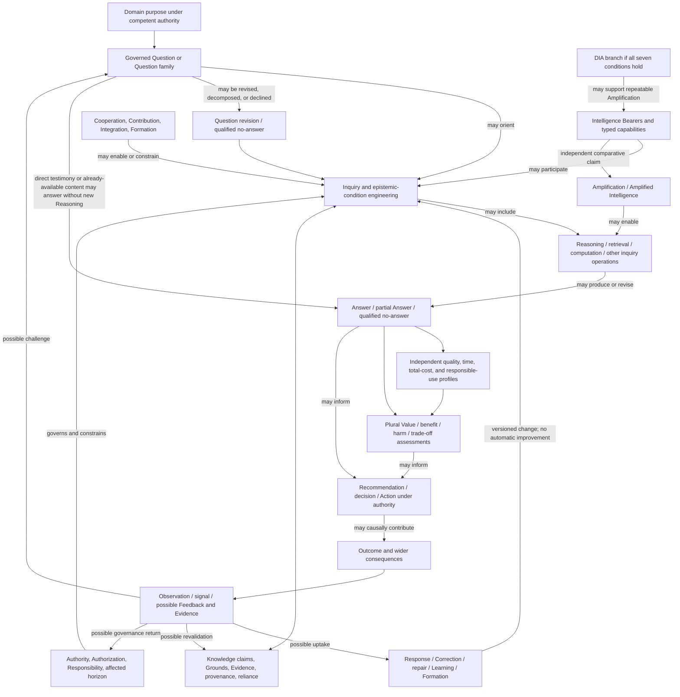

# SymK 2.1.9C — Cross-Cluster Boundary, Value-Chain, and Non-Substitution Integration

**Status:** Analytical working result — no decision authority
**Date:** 22 August 2026
**Working baseline:** `2.1-dev.67`
**Authority:** 2.1.9 opening control `SYMK-2X-EV-149`–`150`; Stream A evidence `SYMK-2X-EV-151`; Stream B evidence `SYMK-2X-EV-152`; project-steward continuation instruction “Go ahead”, recorded with this analysis as `SYMK-2X-EV-153`
**Decision target:** Future Proposed `SYMK-2X-DR-018`; reserved without proposal content or status
**Candidate baseline target:** `2.1-rc.1`; not created
**Depends on:** Stage-Accepted `SYMK-2X-DR-009` through `SYMK-2X-DR-017`; the non-authoritative Stream A normalized inventory; and the noncanonical Stream B typed graph

## 1. Question and analytical result

> Can the accepted structural, Knowledge/Intelligence, Knowledge Engineering, Cooperation/Formation, Responsibility, Amplification/DIA, and Question/Reasoning/Answer/Value systems operate as one coherent conceptual system without turning the Product Vision into a mandatory pipeline, transferring predicates across clusters, making DIA exhaustive, reifying the governed knowledge undertaking, promoting Capability, or creating a contradiction between DR-016 and DR-017?

Stream C supports the following working answer:

> **Yes, provisionally. The accepted clusters integrate coherently when their relations are treated as typed, conditional, branching, independently evidenced, level-sensitive, and recursively challengeable. No cluster is a sufficient cause, universal predecessor, mandatory successor, proxy, or status certificate for another. The Product Vision is therefore a governed branching orientation rather than a production function or workflow.**

> **The governed knowledge undertaking does not require a new disposition for cross-cluster coherence. Its accepted work can be expressed as a bounded, versioned integration lens over an identified Domain purpose, Question or Question family, subjects and affected horizon, epistemic conditions, participants and contributions, roles and authorities, Representations, Reasoning and Answers, Value and consequence claims, and challenge/correction lineage. It is not a new substance, universal object, System class, Bearer, actor, workflow, project, legal person, semantic parent, or container of the accepted concepts. The framework is defined by DR-009–017; an undertaking instance is interpreted under those accepted rules and cannot define them in return. This non-reifying expansion breaks the Stream B high-risk loop without altering DR-017.**

> **Capability likewise does not require promotion. Cross-cluster uses resolve into nine predicate-specific claim families with a common claim envelope but different accepted criteria: Intelligence capacity, Reasoning capacity, Agency capacity, Control capacity, effective capability for Amplification, DIA enabling/support capability, professional or retained capability, developmental capability change, and Learning-related capability change. The word “Capability” is a controlled analytical index across these claims, not one inherited property or admitted concept.**

> **DR-016 and DR-017 are consistent. DR-016 supplies the Question-centered, value-constrained, consequence-sensitive branching and return relations that DR-017 requires; DR-017 supplies the layered identity and non-agent-centric integration frame within which DR-016 operates. DIA remains the principal realization of the Product Vision without exhausting legitimate SymK-governed use. The canonical Product Vision still requires later controlled revision because its linear visual order and DIA-exhaustive wording can mislead, but that source-level mismatch is a migration obligation, not an irreparable accepted-decision contradiction.**

Stream C therefore passes provisionally to separately instructed Stream D. It creates no canonical integrated baseline, Ontology, package, workflow, new disposition, accepted-decision amendment, DR-018 content, or `2.1-rc.1` baseline.

## 2. Authority and interpretation controls

The exact Stage-Accepted DR-009–017 objects govern. This record is an analytical integration Representation and cannot replace their wording, dissent, confidence, reopening conditions, or non-effects.

The Stream B node and edge identifiers remain local. Stream C uses them for traceability but does not convert them into final `FC-*` identifiers, packages, classes, database entities, formal predicates, runtime events, or constitutional categories.

In this record:

- **integration** means that accepted meanings can coexist under explicit typed relations and boundaries;
- **branch** means a permitted, contingent, defeasible route, not an exclusive decision tree or mandatory workflow;
- **gate** means an analytical condition for making a specified claim, not an operational approval step;
- **undertaking** means DR-017's working organizing-center label under the non-reifying expansion in Section 7, not a newly disposed concept;
- **Capability family** means the analytical index in Section 6, not a common transferable property;
- **Product Vision chain** means a human-facing orientation whose arrows must be read through the typed relations and non-entailments below; and
- **pass** means no conceptual contradiction appears at the Stream C lens, not that an actual System, undertaking, project, claim, or outcome satisfies the relation.

## 3. Cross-cluster integration grammar

Every cross-cluster claim must preserve this minimum grammar:

| Field | Required content | Failure prevented |
|---|---|---|
| subject and object | Identified predicate Bearer, target, affected subject, represented object, or relation endpoint | Bearer disappearance and generic “system” claims |
| identity and version | Stable identity criteria plus predecessor, successor, fork, merge, replacement, or revision relation | Name-based continuity and retrospective substitution |
| relation kind | One or more of the Stream B working kinds, each separately directed | Bare “depends on”, “uses”, “supports”, “integrates”, or “governs” |
| modality | Constitutive, necessary, contingent, possible, prohibited, historical, or unresolved | Possibility becoming necessity or observed sequence becoming definition |
| level | Lowest adequate organized level for the predicate and independent higher/lower-level tests | Member/component/participant/whole property transfer |
| Domain, Scope, Context | Material jurisdiction, boundary, purpose, assumptions, and conditions | Universalization of local meanings or authority |
| time and lifecycle | Event, episode, state, version, horizon, persistence, expiry, replacement, and revalidation | Static reading of reciprocal or developmental relations |
| Ground and Evidence | Claim-relative support, provenance, integrity, relevance, uncertainty, counterevidence, and defeaters | Self-validation and artifact-as-Evidence shortcuts |
| assessment and status | Method, assessor, criteria, authority, result, uncertainty, challenge, and regime-specific status | Claim, actual predicate, assessment, status, and record collapse |
| governance | Authority source, jurisdiction, holder, act/object, Authorization, Responsibility, affected standing, and challenge | Authority laundering and responsibility disappearance |
| consequence and return | Observed or claimed effect, causal model, affected horizon, feedback route, correction, and historical lineage | Favorable outcome validating the chain or return manufacturing policy |
| non-entailments | Every materially tempting property, role, status, relation, or implementation transfer rejected by the accepted decisions | Cross-cluster substitution |

No cross-cluster relation is adequate if its intelligibility depends on treating an analytical carrier, undertaking label, graph node, schema field, metric, or implementation event as the actual accepted predicate.

## 4. Integrated cluster-boundary matrix

| # | Interface | Permitted relation | Required guard | Prohibited substitution | Result |
|---:|---|---|---|---|---|
| 1 | structural kernel → every cluster | Identity, Context, Scope, Domain, Relationship, Bearer, Representation, Projection, Applicability, and imported System structure interpretation | Exact object, level, version, relation, and declared loss | structural vocabulary → substantive truth, status, Authority, or package inheritance | Pass |
| 2 | Knowledge ↔ Intelligence | Reciprocal enabling, constraining, developmental, evidentiary, operational, and representational relations | Independent Bearers, actual epistemic/capability criteria, time, Evidence, and no-cross-entailment | Knowledge → Intelligence; Intelligence → Knowledge | Pass |
| 3 | Knowledge Engineering → epistemic conditions | Engineering activity configures and revises accountable conditions around claims, Evidence, reliance, application, and consequence | External Domain objects, actual achievement criteria, uncertainty, challenge, and versioning | engineered artifact/status → Knowledge or truth | Pass |
| 4 | Intelligence → Cooperation | An evidenced Intelligence Bearer may occupy a Participant or contributor role | Role, Contribution, mutual orientation, level, and occurrence independently established | Intelligence → Participation, Cooperation, Authority, or benefit | Pass |
| 5 | Knowledge Engineering ↔ Cooperation | Cooperative contributions may support epistemic engineering; engineered conditions may enable or constrain Cooperation | Participant/engineer/object distinctions, Power, challenge, Evidence, and non-necessity | workflow or shared repository → Cooperation; Cooperation → Knowledge Engineering success | Pass |
| 6 | Cooperation ↔ Formation | Cooperation may form Participants; Formation may condition later Cooperation | Identified formative subject, episode, mechanism, effect, time, competing explanation, and non-necessity | participation → Formation or Learning; Formation → Cooperation | Pass |
| 7 | Cooperation ↔ Responsibility | Cooperative relations expose roles, Power, contributions, dependencies, affected subjects, and answerability routes | Responsibility object and source, Agency/control/causality evidence, Authority, standing, and phase | Contribution/participation/benefit → Responsibility or legitimate Authority | Pass |
| 8 | Formation/Learning → Capability claims | Formation or Learning may contribute to a versioned change in a typed capability | Stable subject/Learner, predicate type, variation, durability, counterfactual, Evidence, and competing explanations | score/behavior/update/member change → capability change or System Learning | Pass |
| 9 | Responsibility ↔ Knowledge Engineering | Governance can authorize, constrain, review, challenge, and correct epistemic-engineering acts | Sourced jurisdiction, separate epistemic assessment, affected standing, and appeal | governance validity → truth; technical capability → Authority | Pass |
| 10 | Responsibility ↔ DIA | DIA design and operation may create multiple prospective, causal, answerability, corrective, and external relations | DIA membership, actor, provider, deployer, Authority, amplified Bearer, affected subject, and responsibility object separately identified | System boundary, Human presence, final approval, or provider status → residual Responsibility | Pass |
| 11 | Intelligence → Amplification | An identified Bearer's relevant effective capability may be compared across support conditions | Same Bearer or declared new-System comparison, dimensions, integration, resources, baseline, variation, Evidence, time, and loss | Intelligence score, output, assistance, automation, or component gain → Amplification | Pass |
| 12 | Amplification → Amplified Intelligence | Amplified Intelligence qualifies Intelligence of the same Bearer when valid Amplification is established | Both predicates independently established; retained/support-conditioned/new-System distinctions visible | Amplification → Intelligence; Intelligence gain in one dimension → total improvement | Pass |
| 13 | Amplification/DIA | A DIA must satisfy all seven class conditions and support repeatable Amplification, but the DIA System need not be the amplified Bearer | System Identity, participant topology, mechanisms, integration, dependency, lifecycle, Evidence, and independent status | AI/software/knowledge base/answer success → DIA; DIA → responsible operation or whole-System Intelligence | Pass |
| 14 | Domain purpose → Question | Competent Domain or project authority may frame purposes that orient Questions | Authority, affected horizon, assumptions, contestability, versioning, and non-exhaustive purposes | stated purpose → legitimate Question, correct frame, Value, or authorized action | Pass |
| 15 | Question ↔ Knowledge/Evidence | Existing Knowledge and Evidence may condition framing and inquiry; Questions may orient acquisition and assessment | Question version, epistemic object, Bearer, Ground, Evidence role, uncertainty, and challenge | source/document/retrieval → Knowledge or Answer; Question → truth | Pass |
| 16 | Question → Reasoning | A Question may orient one or more Reasoning episodes, operations, or other inquiry routes | Answer obligation, reasoner/arrangement, episode, considerations, Domain methods, Evidence, and lineage | inquiry/workflow/computation/retrieval/generation → Reasoning | Pass |
| 17 | Reasoning → Answer | Reasoning may contribute content that answers, partially answers, declines, or revises a Question | Question correspondence, content Identity, coverage, conditions, uncertainty, source/contribution, and assessment | Reasoning → Answer; valid process → good Answer; correct Answer → claimed process | Pass |
| 18 | Answer → quality/time/cost/Value profiles | An Answer version may be assessed under independently governed profiles | Same Question/use/affected horizon, dimensions, Evidence, method, authority, uncertainty, distribution, and non-compensable conditions | Answer → quality, Value, actionability, lower cost, or responsible use | Pass |
| 19 | Answer/Value → recommendation/decision/action | Answers and Value claims may inform governance choices | Decision object, alternatives, competent Authority, Authorization, duties, affected standing, uncertainty, and dissent | Answer/recommendation/optimization/approval → decision, Action, or Ratification | Pass |
| 20 | decision/action → outcome/consequence | Authorized acts or omissions may causally contribute to realized states and wider effects | Actual event, causal model, counterfactual, other contributors, time, affected horizon, uncertainty, and independent Responsibility analysis | intended/authorized Action → intended outcome; causal contribution → Responsibility | Pass |
| 21 | consequence → feedback/correction/Learning/governance return | Consequences may become observed signals, Evidence, challenge, correction input, or later Learning conditions | Observation integrity, relevance, receipt, interpretation, uptake, authority, changed state, verification, stable Learner, and lineage | consequence → Evidence, defect, Correction, Learning, policy, concept change, or constitutional change | Pass |
| 22 | layered identity → DIA and non-DIA realizations | DIA is principal realization; bounded SymK distinctions may also govern legitimate non-DIA cases | Exact status claim, applicable accepted concepts, non-exhaustiveness, jurisdiction, and no label promotion | SymK-compatible/governed use → DIA; non-DIA → outside all SymK meaning | Pass |
| 23 | framework → governed knowledge undertaking | Framework supplies accepted rules for interpreting a bounded configuration of relations | Non-reifying expansion in Section 7 and exact DR-009–017 sources | undertaking → System/class/Bearer/workflow; undertaking instance → framework definition | Pass provisionally |
| 24 | every cluster → Human/Scientific/Engineering Views | Meanings may be expressed, assessed, and engineered through aligned but non-identical Views | Source/target object, transformation, omission, uncertainty, disagreement, reversibility, authority, and loss | readability/validity/precision → adequacy of the other Views | Pass provisionally; Stream D owns full audit |

All twenty-four interfaces are coherent at the conceptual level. None requires a new relation kind beyond Stream B's nineteen-kind working vocabulary. A workflow or branching order is represented through combinations of typed relations and modality; it is not a twentieth semantic relation kind.

## 5. Stable boundary invariants

The integrated system requires the following invariants across every branch:

1. actual predicate, claim, assessment, status, and record remain distinct;
2. subject, object, Bearer, Participant, contributor, Agent, Authority holder, responsible subject, beneficiary, affected subject, provider, assessor, and decision-maker remain role-typed;
3. component, member, dyad, team, institution, profession, configured System, distributed arrangement, hybrid formation, predecessor, and successor levels do not inherit one another's predicates;
4. Knowledge, Intelligence, Reasoning, Answer, quality, Value, outcome, and Learning remain independent predicates;
5. Cooperation, coordination, communication, workflow, interaction, Integration, and aggregation remain independent relations;
6. Agency, causal Contribution, control, Authority, Authorization, Responsibility, accountability, liability, standing, consent, and remedy remain independent;
7. Amplification, assistance, automation, substitution, replacement, performance, output, score, and DIA membership remain independent;
8. Question, formulation, prompt, request, task, frame, decision problem, inquiry, and record remain independent;
9. Reasoning, inference, computation, retrieval, generation, explanation, trace, and output remain independent;
10. Answer, response, recommendation, decision, Action, outcome, and consequence remain independent;
11. quality, speed, total cost, Value, benefit, harm, trade-off, and responsible-use assessments remain plural and non-scalar;
12. observation, signal, measurement, Evidence, feedback, uptake, Correction, update, capability change, Learning, Formation, and improvement remain independent;
13. Human, Scientific, and Engineering Views remain Representations with transformation and loss rather than competing owners of meaning;
14. universal SymK semantics, constitutional norms, Domain methods, external authority, derived-project specialization, and implementation remain jurisdictionally distinct;
15. historical origin, accepted DIA orientation, general framework identity, principal realization, and project realization remain layered rather than mutually erasing; and
16. every revised Question, Answer, status, assessment, configuration, policy, concept, or constitutional object preserves version and challenge lineage.

Violation of an invariant is an integration or representation defect unless exact accepted clauses make the violation unavoidable. No such unavoidable violation is found.

## 6. Capability-family coherence test

### 6.1 Typed claim families

| Code | Capability claim family | Accepted source | Required Bearer and predicate | Non-transfer guard |
|---|---|---|---|---|
| `C-CAP-01` | Intelligence capacity | DR-011 | Lowest adequate organized Intelligence Bearer; scoped multidimensional capacity under relevant variation | performance, score, member, component, or provider capability does not transfer |
| `C-CAP-02` | Reasoning capacity | DR-016 | Identified Human, artificial, collective, institutional, distributed, hybrid, or organized arrangement for declared reasoning episodes/types | one output, inference, trace, explanation, or contributor does not establish capacity |
| `C-CAP-03` | Agency capacity | DR-014 | Identified organized subject's target-specific selection and control capacity | execution, output, autonomy label, or causal effect does not establish Agency |
| `C-CAP-04` | Control capacity | DR-014 | Subject/target/dimension-specific capacity to make a governed difference | nominal role, access, supervision, influence, or Authority does not establish effective control |
| `C-CAP-05` | Effective capability used in Amplification | DR-015 | Same identified amplified Bearer across materially comparable supported and baseline conditions, or an explicit new-System comparison | assistance, speed, scale, automation, substitution, or one-dimensional gain does not establish Amplification |
| `C-CAP-06` | DIA enabling/support capability | DR-015 | Identified mechanisms and configured relations by which a DIA supports repeatable Amplification | DIA membership does not transfer the supported capability to the DIA, provider, participant, or every user |
| `C-CAP-07` | Professional or retained capability | DR-015/013 | Identified professional, role, profession, institution, or successor under a declared support/removal/time condition | supported performance, role occupancy, credential, historical contribution, or successor name does not establish retention |
| `C-CAP-08` | Developmental capability change | DR-013/015 | Identified formative subject across versioned states with mechanism, variation, persistence, and competing explanations | Formation, training, participation, or exposure does not entail capability gain or improvement |
| `C-CAP-09` | Learning-related capability change | DR-013/016 | Stable Learner at the claimed level with comparatively durable experience-linked change manifested beyond immediate support | update, replacement, retrieval, current Context, member change, behavior, or improved score does not establish Learning |

### 6.2 Common capability-claim envelope

The shared analytical envelope contains: predicate family; identified Bearer; adequate level; target object or task; dimensions; Domain; Scope; Context; relevant variation; baseline or prior version; support and resources; integration and dependency; time and persistence; Evidence and counterevidence; assessment method and authority; uncertainty; distribution and loss; removal, replacement, and succession; challenge; and non-entailments.

The envelope is reusable because these are claim-control fields, not because every capability is one substance. The nine families have different nuclei, criteria, causal models, authorities, and failure modes. No cross-family inference is valid without a separately evidenced relation.

### 6.3 Disposition result

Capability can remain an analytical cross-package index. It does not pass a need-for-disposition test at Stream C because:

1. every accepted use maps to one or more of the nine typed families;
2. no accepted definition requires a common universal capability entity or property;
3. the common envelope is adequately owned by claim/assessment and Bearer discipline rather than a new semantic anchor;
4. homonymous use is controlled through family code, predicate, Bearer, level, and source;
5. no mandatory case fails without a promoted Capability concept; and
6. promotion would create an unjustified inheritance path among Intelligence, Agency, control, Amplification, Formation, and Learning.

This result remains reopenable if Stream D cannot map the families without semantic loss, Stream F finds unmappable accepted passages or project cases, or formalization later requires a governed supporting relation whose meaning cannot be stated through the existing anchors.

## 7. Governed knowledge undertaking test

### 7.1 Non-reifying expansion

For Stream C, a reference to a **governed knowledge undertaking** expands into the following relation bundle rather than a new object class:

1. an identified and versioned Domain purpose, Question, Question family, or epistemic/practical object;
2. applicable Domain, Scope, Context, assumptions, uncertainty, time, and affected horizon;
3. identified Intelligence Bearers and other participants, sources, resources, institutions, systems, and Representations with separately evidenced roles;
4. Knowledge claims, Grounds, Evidence, provenance, status, reliance, disagreement, and challenge relations;
5. Knowledge Engineering activities and epistemic-condition lifecycle relations;
6. Cooperation, Contribution, Integration, dependency, Power, Formation, Feedback, Uptake, Correction, and Learning relations where they actually occur;
7. Agency, causal Contribution, control, Authority, Authorization, Responsibility, standing, consent-integrity, response, and external-jurisdiction relations where applicable;
8. Amplification, amplified-Bearer, DIA, professional-capability, and lifecycle claims where independently established;
9. inquiry, Reasoning, Answer, quality, time, total-cost, Value, recommendation, decision, Action, outcome, consequence, and trade-off relations where applicable; and
10. Representation, View, record, version, challenge, correction, migration, and historical lineage across the bundle.

The bundle is open-textured: not every relation occurs in every legitimate case. Its center is a traceability and governance frame, not a requirement that one workflow, participant count, System boundary, lifecycle, output, DIA status, or final Answer exist.

### 7.2 Identity and boundary rule

An analytical undertaking reference is adequate only when it names the governing Question/purpose/object, material Scope and Context, participating and affected subjects, relevant time/version, and the relation bundle being considered. A material change to these may create a revised analytical frame, but Stream C does not create a universal undertaking-Identity theory.

The boundary may cross organizational, technical, representational, or System boundaries. It must not erase those boundaries or imply that the undertaking is their owner, whole, superclass, legal container, or responsible subject.

### 7.3 Necessity and non-substitution result

The label is useful but semantically eliminable: every claim made through it can be restated using accepted concepts and typed relations. It therefore does not need Foundational or governed-supporting disposition for conceptual coherence.

The label also remains necessary at the human-facing analytical level because it prevents an isolated actor, artifact, DIA, Answer, workflow, or metric from becoming the organizing reference and makes the complete relation bundle discussable. Analytical usefulness is not semantic irreducibility.

The following substitutions remain prohibited:

- governed knowledge undertaking → Entity, System, DIA, Bearer, Agent, actor, collective, institution, project, workflow, legal person, or package;
- governed knowledge undertaking → Cooperation, Knowledge Engineering, inquiry, Reasoning, or lifecycle process;
- governed knowledge undertaking → one Question, Answer, decision, outcome, objective, value function, record, graph, or implementation;
- participation in an undertaking → Intelligence, Cooperation, Authority, Responsibility, consent, benefit, or standing;
- governance of an undertaking → truth, Knowledge, responsible operation, legitimate outcome, or moral/legal completeness; and
- undertaking centrality → semantic, epistemic, moral, legal, political, organizational, or implementation sovereignty.

### 7.4 Circularity result

The Stream B loop is repaired as follows:

1. DR-009–017 independently define the framework's accepted concepts and governance conditions.
2. DR-017 uses “governed knowledge undertaking” as a non-reifying organizing label for applying those conditions together.
3. An analytical undertaking bundle is interpreted under the framework; it does not constitute, validate, authorize, or redefine the framework.
4. Evidence from actual undertakings may challenge the framework through governed return, but repeated practice or successful implementation cannot revise universal meaning automatically.

The resulting relation is framework → interpretive/governance conditions → analytical undertaking bundle → possible evidentiary challenge return. It is recursive but not definitionally circular or self-validating.

### 7.5 Remaining dissent

Stream C does not settle whether the term belongs in the final Product Vision wording, a 2.5 package index, a methodology vocabulary, or human-facing guidance; whether one Intelligence Bearer can constitute the relevant general realization; or whether a different label would avoid intentional, organizational, or workflow implications better. Those are preserved for Streams D–F and the DR-018 gate.

## 8. Branching Product Vision reconstruction

The canonical Product Vision presents one explanatory vertical chain. DR-016 and DR-017 require the following branching interpretation:

This diagram is an analytical Representation. It is neither the final Product Vision revision nor a prescribed architecture or process.

### 8.1 Twenty branch and claim gates

| Gate | Claim enabled if separately established | What the prior branch does not entail |
|---:|---|---|
| 1 | Domain purpose has applicable authority and affected-horizon visibility | legitimacy, completeness, or one final objective |
| 2 | Question is identified, scoped, challengeable, and versioned | correct frame, answerability, complexity, or value |
| 3 | Inquiry is organized around the governed Question | Reasoning, Cooperation, workflow adequacy, or eventual Answer |
| 4 | Knowledge/Evidence bears the accepted epistemic relation | artifact possession, citation, status, or retrieval is not Knowledge |
| 5 | Intelligence is attributed to each adequate organized Bearer | participation, Agency, Authority, Responsibility, or whole-level Intelligence |
| 6 | Cooperation actually occurs under DR-013 | plurality, communication, coordination, consent, fairness, or benefit |
| 7 | Formation or Learning actually occurs at an identified subject/level | participation, feedback, update, behavior change, or improvement |
| 8 | Responsibility/Authority relations are sourced and jurisdictionally valid | capability, expertise, Human presence, System boundary, or final approval is insufficient |
| 9 | Amplification is established for the same Bearer or explicit new-System comparison | assistance, automation, performance, score, or one gain is insufficient |
| 10 | DIA membership satisfies all seven conditions | AI, Knowledge base, cooperation, Amplification claim, or branded status is insufficient |
| 11 | Reasoning episode is evidenced at the claimed arrangement and level | computation, retrieval, generation, trace, or fluent explanation is insufficient |
| 12 | Content answers the identified Question version and obligation | output, truth, relevance, response, or recommendation is insufficient |
| 13 | Answer Quality is assessed dimension by dimension | correctness, confidence, score, approval, or favorable outcome is insufficient |
| 14 | Speed comparison uses comparable events and obligations | lower latency, better Answer, lower total cost, or greater Value |
| 15 | Total-cost profile identifies objects, Bearers, boundaries, transfers, and exclusions | price, payment, compute, budget, or provider cost is insufficient |
| 16 | Value relation identifies claimants, beneficiaries, affected subjects, criteria, authority, horizon, and distribution | utility, preference, benefit, market price, quality, or outcome is insufficient |
| 17 | Recommendation/decision/Action has competent Authority and Authorization | best Answer, optimization, adoption, approval, or capability is insufficient |
| 18 | Outcome/consequence and causal Contribution are independently assessed | intent, authorization, success, failure, or correlation is insufficient |
| 19 | Feedback/Evidence transition has integrity, relevance, assessment, and receipt | observation, signal, measurement, rating, complaint, or dashboard is insufficient |
| 20 | Correction/Learning/governance return is separately authorized, evidenced, versioned, and challengeable | response, changed state, update, improved score, repeated practice, or favorable result is insufficient |

No gate requires every prior gate. For example, a pre-existing Answer may be available without a new Reasoning episode; a SymK-governed non-DIA case may use the semantic minimum without DIA membership; a qualified no-answer may satisfy an answer obligation without decision or Action; and a consequence may reopen the Question rather than produce Correction or Learning.

## 9. Non-substitution family audit

The complete accepted prohibited-entailment clauses remain controlling. Stream C groups their cross-cluster combinations into the following thirty families without replacing the exact clauses:

| # | Family | Tempting cross-cluster collapse rejected | Integrated result |
|---:|---|---|---|
| 1 | artifact/predicate | document, data, graph, schema, record, status, model, or code → represented predicate | Rejected; Representation and actual predicate remain non-identical |
| 2 | source/Knowledge | source, citation, provenance, retrieval, repository, authority, or accepted record → Knowledge | Rejected; Bearer and epistemic achievement remain separately assessed |
| 3 | Knowledge/Intelligence | Knowledge ↔ Intelligence as constitutive or automatic attribution | Rejected; only typed reciprocal relations survive |
| 4 | capability/performance | score, output, speed, benchmark, task success, or provider claim → capability | Rejected; predicate-specific capability claim required |
| 5 | component/whole | member, component, participant, provider, or predecessor predicate → whole/successor predicate, and conversely | Rejected; adequate level and independent Evidence required |
| 6 | role/predicate | Participant, contributor, Agent, reviewer, expert, operator, source, beneficiary, or affected party → another role or substantive predicate | Rejected; every role relation is separately evidenced |
| 7 | plurality/Cooperation | multiple parties, communication, interaction, workflow, coordination, consensus, or shared resource → Cooperation | Rejected; Contribution and mutual orientation required |
| 8 | Cooperation/normativity | Cooperation → consent, fairness, legitimate Authority, Responsibility, benefit, Value, or ethical adequacy | Rejected; Power and external authority remain visible |
| 9 | Formation/Learning | Education, training, participation, feedback, correction, update, behavior change, or score change → Formation, capability change, Learning, or improvement | Rejected; stable subject, mechanism, persistence, variation, and Evidence required |
| 10 | causality/Agency | event, output, execution, influence, autonomy label, or causal Contribution → Agency or Action | Rejected; target-specific capacity/exercise/effect distinctions survive |
| 11 | Authority/epistemic force | title, expertise, canonical location, access, capability, approval, or Authority → truth, Knowledge, warrant, quality, or Value | Rejected; epistemic and governance relations remain independent |
| 12 | Authority/Responsibility | Authority, Authorization, delegation, supervision, final approval, legal entity, Human presence, or System boundary → complete or residual Responsibility | Rejected; object-first sourced allocation remains independent |
| 13 | contribution/Responsibility | participation, contribution, causation, control, provider relation, or benefit → Responsibility, blame, liability, or remedy | Rejected; phase, standard, source, standing, and response relation required |
| 14 | consent/standing | notice, use, access, participation, agreement, adoption, or formal acceptance → understanding, voluntariness, practical refusal, consent, or standing | Rejected; external and Domain authority retained |
| 15 | assistance/Amplification | access, content, assistance, automation, substitution, replacement, acceleration, scale, output, or gain → Amplification | Rejected; comparative same-Bearer/equivalent-system causal claim required |
| 16 | DIA shortcut | AI, software, Knowledge base, multiple participants, Cooperation, Answer success, Amplification, or label → DIA | Rejected; all seven class conditions remain necessary |
| 17 | DIA/normativity | DIA membership → whole-System Intelligence, responsible operation, Value, benefit, Authority, or exhaustive SymK identity | Rejected; descriptive class and qualifications remain separate |
| 18 | prompt/Question | wording, prompt, request, task, query, ticket, frame, or workflow → governed or unchanged Question | Rejected; material Question relations and lineage govern Identity |
| 19 | operation/Reasoning | inquiry, inference, proof, computation, retrieval, simulation, generation, explanation, rationale, trace, or output → complete or sound Reasoning | Rejected; consideration-sensitive episode and Evidence required |
| 20 | output/Answer | response, output, true statement, relevant content, explanation, recommendation, or decision support → Answer | Rejected; Question correspondence and answer obligation govern |
| 21 | Answer/downstream act | Answer → recommendation, decision, Authority, Authorization, adoption, Action, outcome, Responsibility, or Value | Rejected; governance and causal relations are independent |
| 22 | quality scalar | correctness, truth, relevance, completeness, confidence, fluency, benchmark, threshold, compliance, or average score → total Answer Quality | Rejected; multidimensional profile and non-compensable failures survive |
| 23 | speed/cost/value | shorter time, lower price, lower provider cost, higher score, or favorable outcome → better, lower total cost, or greater Value | Rejected; independent comparison profiles required |
| 24 | value/legitimacy | utility, preference, goal attainment, price, aggregate benefit, net benefit, or optimization → legitimate Value or authorized choice | Rejected; plural claimants, distributions, standing, authority, and non-compensable constraints remain |
| 25 | outcome/upstream validation | success or favorable outcome → correct Question, Knowledge, sound Reasoning, good Answer, responsible use, valid Authority, Value, or complete chain | Rejected; causal and evidentiary return is defeasible and typed |
| 26 | signal/Evidence | occurrence, observation, signal, measurement, rating, complaint, anomaly, or dashboard → valid Evidence, defect, or absence of consequence | Rejected; Ground, integrity, relevance, uncertainty, and assessment required |
| 27 | feedback/Correction | transmission, receipt, interpretation, uptake, response, edit, apology, rollback, or “fixed” status → Correction, repair, or remedy | Rejected; actual changed state, verification, affected response, residual, and history required |
| 28 | change/Learning | update, adaptation, replacement, member change, behavior change, capability change, or improved score → Learning or improvement | Rejected; stable Learner and separate Value assessment required |
| 29 | undertaking reification | integration label, graph node, shared purpose, workflow, project, or relation bundle → new object, System, Bearer, actor, semantic parent, or sovereign center | Rejected; non-reifying expansion controls every use |
| 30 | implementation/universal meaning | project success, project Ontology, metric, schema, repeated practice, implementation, or provider architecture → universal SymK concept, policy, or constitutional commitment | Rejected; challenge may return, but decision authority remains external to the evidence |

Every family survives combination across the twenty-four interfaces. No accepted prohibited entailment is found to require reversal, exception, or predecessor reopening.

## 10. DR-016 / DR-017 consistency audit

| Question | DR-016 contribution | DR-017 contribution | Stream C result |
|---|---|---|---|
| organizing reference | Governed Question, affected horizon, Answer relation, Value, consequence, and recursive return | Governed knowledge undertaking rather than isolated actor or artifact | Consistent when undertaking expands into the accepted relation bundle rather than a new object |
| SymK identity | Supplies the complete question-to-consequence semantics but does not redefine SymK | Supplies broader responsible Knowledge Engineering identity and layered history | Complementary; neither substitutes for the other |
| DIA relation | Keeps DIA, Amplification, Question, Reasoning, Answer, Value, outcome, feedback, and Learning independent | Makes DIA principal but non-exhaustive realization | Consistent; optional DIA branch preserves focus without exhaustiveness |
| Cooperation | Preserves DR-013 and separates Cooperation from final Value | Makes governed cooperation constitutive of the general framework | Consistent; actual Cooperation still requires DR-013 and is not the final objective |
| actor centrality | Separates reasoner, source, decision authority, responsible subject, beneficiary, and affected subject | Rejects Human, AI, System, institution, graph, or workflow sovereignty | Consistent and mutually reinforcing |
| Human standing | Preserves affected horizon, external Authority, Responsibility, responsible-use, and challenge | Explicitly blocks Human/Authority/Responsibility erasure | Consistent; non-anthropocentrism does not imply equivalence or equal standing |
| value chain | Requires branching, defeasible, multidimensional, non-automatic relations | Reframes output production as recursive governed epistemic lifecycle | Consistent; canonical linear diagram needs later revision only |
| Knowledge Engineering object | Keeps epistemic conditions, Evidence, feedback, correction, and lineage distinct | Says SymK engineers accountable conditions, not Knowledge or truth directly | Consistent with DR-012 and the general identity wording |
| bounded jurisdiction | Routes methods, metrics, thresholds, law, ethics, rights, remedies, and actual trade-offs externally | Rejects generic Knowledge Engineering or unlimited governance expansion | Consistent; both require competent external and Domain authority |
| final package/status | Leaves compounds/supporting families routed but not packaged | Leaves undertaking as working label and identity direction | Consistent; 2.5 remains owner of package decisions |

### 10.1 Canonical Product Vision mismatch classification

The canonical v0.3 Product Vision is earlier Stage-Accepted wording and remains authoritative as a directional source. Its one-line vision—“the engineering discipline for creating Domain Intelligence Amplifiers”—and vertical chain can be read as exhaustive and linear. DR-017 later Stage-Accepts a broader layered identity and DR-016 later Stage-Accepts non-linear value-chain distinctions.

Stream C classifies this as a **controlled source-expression and migration mismatch**, not a semantic contradiction, because:

1. DR-017 explicitly preserves DIA as principal realization and requires later controlled Product Vision revision;
2. DR-016 explicitly preserves the chain as governed orientation rather than guaranteed production function;
3. the earlier wording and later direction can coexist under historical lineage, principal-realization, non-exhaustiveness, and revision obligations;
4. no actual source text is silently amended by this analysis; and
5. Stream F and 2.1.10 own exact affected passages, alternatives, authorization, and revision.

If later review cannot produce wording that preserves both the broader framework and DIA operational focus, the affected DR-017/Product Vision relation must be reopened. No such impossibility is established here.

### 10.2 Residual identity tension

`SYMK-2X-TN-031` remains active. Stream C narrows but does not resolve it: the layered model is conceptually coherent, while the optimal canonical prominence, wording, and operational testability of the general framework, DIA, and governed-undertaking label remain open.

## 11. Mandatory cross-package counterexamples — Stream C lens

| # | Cross-cluster test | Required distinctions | Result |
|---:|---|---|---|
| 1 | A Human and an artificial component each possess relevant Intelligence, but their aggregation lacks whole-level Intelligence, Cooperation, or Reasoning | Separate Bearers, levels, relation-enabled organization, Cooperation occurrence, and Reasoning episode Evidence | Pass. Plural Intelligence creates no whole-level predicate. |
| 2 | A configured System validly bears amplified capability while Authority and Responsibility remain with different external subjects | Same configured amplified Bearer; independent provider, Authority holder, responsible subjects, affected horizon, and DIA status | Pass. Capability attribution, Authority, and Responsibility do not transfer. |
| 3 | Governed Knowledge exists without a current Answer, and an Answer exists without becoming Knowledge | Knowledge Bearer/achievement, Question version, Answer relation, epistemic assessment, and status | Pass. Neither Foundational predicate constitutes the other. |
| 4 | A participant contributes Evidence without becoming a Knowledge Bearer, reasoner, decision authority, or responsible subject for the whole undertaking | Participant, contributor, source, Ground/Evidence role, reasoner, Authority, and Responsibility independently typed | Pass. The undertaking bundle preserves each role. |
| 5 | Valid Reasoning produces a poor Answer because the Question version or answer obligation was wrong | Reasoning episode validity, Question Identity/version, Answer correspondence, and quality profile | Pass. Process adequacy cannot repair the wrong governed object. |
| 6 | A high-quality Answer creates low or negative Value for a materially affected subject | Answer-quality dimensions, intended use, Value claimant, beneficiary, affected subject, harm, distribution, and authority | Pass. Quality does not entail Value, benefit, or legitimate use. |
| 7 | A favorable outcome occurs despite poor Reasoning, and an adverse outcome occurs despite responsible Reasoning and Answer use | Upstream assessments, actual Action, causal model, outside intervention, consequence, uncertainty, and return | Pass. Outcome does not validate or falsify the entire chain. |
| 8 | Feedback reaches a System but is not valid Evidence, is not taken up, and produces no Correction or Learning | Transmission, receipt, integrity, relevance, interpretation, uptake, changed state, verification, and stable Learner | Pass. Every transition remains contingent. |
| 9 | Member Learning occurs while whole-System capability declines, and System behavior improves through replacement without System Learning | Member/System Learners, capability dimensions, aggregation, retention, replacement, successor, behavior, and Learning Evidence | Pass. Levels and causal alternatives prevent transfer. |
| 10 | Cooperation occurs under unequal Power without valid consent, legitimate Authority, fair benefit, or complete Responsibility allocation | Actual Cooperation, Power, affected standing, consent-integrity, Authority source, Value distribution, and responsibility objects | Pass. Cooperation is descriptive/structural, not complete normativity. |
| 11 | An undertaking is SymK-governed but does not satisfy all seven DIA conditions | Applicable SymK relation bundle, status claim, DIA criteria, and non-exhaustive identity | Pass. Non-DIA governed use remains coherent. |
| 12 | A DIA satisfies its descriptive class while operating irresponsibly or producing transferred costs and harms | DIA membership, responsible qualification, total-cost/Value profiles, affected subjects, causal Contribution, and response | Pass. Descriptive class has no responsible-operation entailment. |
| 13 | The same concept maps across Human and Scientific Views but loses an affected-subject relation in the Engineering View | Source meaning, mapping, omission, loss, affected subject, and invalid downstream reliance | Pass at boundary level; loss is detectable and blocks equivalence. Stream D owns full mapping. |
| 14 | A precise schema or graph is internally consistent but represents the wrong Scope, Domain, Bearer, or Question version | Semantic object/version, Representation/Projection relation, Scope/Domain/level metadata, and validation | Pass. Formal precision has no semantic priority. |
| 15 | A successful project Ontology or metric conflicts with universal SymK meaning | Universal semantic minimum, project specialization, Projection, evidence return, challenge, and decision authority | Pass. Local success may challenge but cannot redefine automatically. |
| 16 | A0 makes Cooperation the final objective, conflicting with DR-017 and DR-016 | Purpose/process/Value distinctions, authority ranking, candidate status, and constitutional review route | Pass as a visible future conflict. A0 remains Proposed; Stream E owns axiom-readiness analysis. |
| 17 | The governed-undertaking label improves integration but is unnecessary as a separate Foundational concept | Non-reifying expansion, semantic eliminability, analytical utility, and DR-009 admission criteria | Pass. This is the adopted analytical result, not a new disposition. |
| 18 | A genuine irreparable conflict between two Stage-Accepted clauses is sought | Exact clauses, authority, Scope, Context, Domain, level, Representation, relation kind, non-entailment, and reopening route | No such conflict found. The Product Vision mismatch is representational/migrational; accepted DR-009–017 remain coherent. |

All eighteen mandatory cases pass at the Stream C lens. Cases 13 and 16 retain explicit Stream D and Stream E ownership, respectively; their passage means that the integrated system detects and routes the problem rather than silently solving it.

## 12. Additional cross-cluster negative controls

| # | Negative control | Required Stream C result |
|---:|---|---|
| 1 | A single expert answers a bounded Question using governed Evidence without Cooperation or DIA status | SymK concepts may interpret the case; do not manufacture Cooperation, heterogeneous realization, or DIA status. Exact general-realization sufficiency remains open. |
| 2 | A Human-only institution cooperates across plural expertise with no AI | Origin does not matter; Cooperation and institutional Intelligence remain separately evidenced; DIA still requires seven conditions. |
| 3 | Multiple AI agents exchange messages under one orchestrator | Message exchange and origin plurality do not establish distinct Intelligence Bearers, Cooperation, whole-level Reasoning, or DIA. |
| 4 | A knowledge service applies SymK provenance and challenge rules but claims no DIA | Bounded SymK-governed use remains legitimate without class promotion. |
| 5 | A DIA coordinates intelligent participants but has no evidenced whole-System Intelligence | DIA class may hold without whole-System Intelligence; do not transfer participant capacities. |
| 6 | A configured System shows a new capability while every user loses unaided capability | System Amplification and user deskilling may coexist; identify Bearers, dimensions, support conditions, distribution, and Value. |
| 7 | An authoritative repository supplies an obsolete claim | Canonical status and provenance do not manufacture current Knowledge, Applicability, or reliance. |
| 8 | A reliable source supplies Evidence but no participant understands it | Evidence role, Knowledge bearing, understanding, Reasoning, and responsible reliance remain separate. |
| 9 | Knowledge Engineering creates a perfect audit trail around a false claim | Engineering quality does not manufacture truth, Knowledge, or valid reliance. |
| 10 | Cooperative participants reach consensus through domination | Cooperation or consensus can coexist with Power abuse, invalid consent, weak Evidence, and negative Value. |
| 11 | Training improves supported performance but not retained professional capability | Separate immediate support-conditioned performance, Formation, retention, Learning, and Amplification claims. |
| 12 | A valid Authority orders use of a low-quality Answer | Governance validity does not create Answer Quality; duties, challenge, refusal, Responsibility, and consequence remain visible. |
| 13 | A high-quality Answer cannot be acted on lawfully | Quality, Value, actionability, legal Authority, decision, Action, and outcome remain independent. |
| 14 | A responsible process produces harm because material Context changed after reliance | Preserve prior assessment, new Context, application, causal Contribution, consequence, response, and Responsibility inquiry without retrospective collapse. |
| 15 | A fast Answer shifts verification and correction burden to affected parties | Immediate latency falls while total cost and Value may worsen; burden transfer remains explicit. |
| 16 | A low-price System creates irreversible dependency and professional deskilling | Price, total cost, dependency, capability continuity, Formation, Value, and trade-off remain independently governed. |
| 17 | An aggregate benefit exceeds measured harm but one non-compensable right is violated | Optimization and aggregate Value do not authorize the choice or erase external Authority and standing. |
| 18 | A favorable outcome comes from an unauthorized intervention | Outcome, causal Contribution, Authorization, Responsibility, Answer use, and Value remain separate. |
| 19 | A false complaint reveals that the challenge channel excludes affected subjects | Defect claim may fail while a separate governance-access defect is evidenced. |
| 20 | A verified local Correction restores a dangerous downstream dependency | Correction is scoped and mixed; downstream consequence, residual risk, and new challenge remain open. |
| 21 | Replacement improves System output immediately | Improvement may occur without Learning by the predecessor, successor, members, or whole System. |
| 22 | Members learn, but the institution loses capability after turnover | Member Learning does not establish institutional retention or System Learning. |
| 23 | Human and Scientific Views agree while an Engineering schema omits dissent | The Projection is materially lossy and cannot support equivalent status or responsible use. |
| 24 | Engineering monitoring is precise but excludes an affected population | Absence of recorded harm is not absence of harm; affected-horizon and View mapping fail. |
| 25 | A provider labels its workflow a governed knowledge undertaking | The label grants no identity, status, System boundary, Cooperation, Responsibility, or SymK compatibility. |
| 26 | A project graph reproduces the 47 Stream B nodes exactly | Structural similarity grants no canonical Ontology status or actual predicate satisfaction. |
| 27 | A Question ends in a warranted no-answer that prevents immediate harm but creates later cost | Answer obligation, quality, Value, cost, horizon, and consequence remain temporally plural. |
| 28 | Consequences require reframing the original Question rather than correcting the Answer | Recursive return may create a new Question version; correction is not the only valid route. |
| 29 | Repeated project success appears to contradict an accepted universal boundary | Evidence triggers challenge and possible reopening; repetition does not create universal meaning or policy. |
| 30 | Historical Human–AI protocol works well for one project | It may remain a derived specialization; success does not restore its fixed dyad as universal SymK identity. |

All thirty controls pass. They show that the integrated model supports absent branches, mixed outcomes, cross-level divergence, non-DIA use, external authority, and recursive revision without weakening accepted boundaries.

## 13. Alternatives and stable-boundary audit

| Alternative | Attraction | Failure under accepted boundaries | Stream C treatment |
|---|---|---|---|
| one linear Product Vision pipeline | Simple explanation and implementation mapping | Implies universal order, necessity, automatic transitions, and one terminal success condition | Rejected as semantics; retain only as historically useful visual requiring later revision |
| mandatory DIA center | Preserves 2.0 operational focus | Makes DIA exhaustive and excludes legitimate bounded non-DIA use | Rejected; DIA remains principal realization |
| governed undertaking as new Foundational concept | Gives the integration frame a named object | Fails semantic irreducibility and risks System/workflow/actor reification | Not supported by Stream C |
| governed undertaking as universal System class | Enables neat architecture and records | Erases cross-System, institutional, representational, and external-authority boundaries | Rejected |
| Question as the sole center | Clear inquiry orientation | Cannot alone express participants, epistemic conditions, Responsibility, Value, consequences, or lineage | Rejected as exhaustive; Question remains central relation in the bundle |
| Intelligence ecology as center | Highlights plural Bearers | Re-centers actors, romanticizes plurality, and hides non-intelligent roles, Power, and affected subjects | Rejected as exhaustive; ecology language remains explanatory only |
| one Human, AI, institution, or System as sovereign center | Clear accountability or implementation owner | Confuses local Authority/Responsibility with semantic sovereignty and erases distributed relations | Rejected |
| Capability as new common concept | Reduces repeated wording across packages | Creates property inheritance and obscures nine distinct predicates and criteria | Not supported; typed analytical index retained |
| one mandatory governance workflow | Improves operational consistency | Turns concept relations into process bureaucracy and fails absent/alternative branches | Rejected; later projects may specialize workflows |
| one constrained-value scalar | Supports ranking and optimization | Erases dimensions, distribution, non-compensable conditions, authority, and uncertainty | Rejected |
| no integration label | Avoids reification | Makes the complete relation bundle difficult to discuss and invites actor/artifact recentering | Rejected for human-facing analysis; label retained with expansion rule |
| generic Knowledge Engineering identity | Aligns with a recognized field | Loses SymK's bounded cooperation, DIA, responsibility, View, Value, and return commitments | Rejected under DR-017 |
| graph as canonical Ontology | Provides immediate machine-readable structure | Preempts 2.5/2.9 and turns analytical grouping into universal meaning | Rejected |

The adopted analytical combination is: layered identity; DIA as principal non-exhaustive realization; governed undertaking as non-reifying integration label; typed Capability index; branching value-chain orientation; and exact accepted concepts as the sole semantic authority.

## 14. Stream C integration checks

| Check | Result | Qualification or later owner |
|---|---|---|
| all seven substantive cluster groups integrated | Pass | Final package anatomy remains 2.5 |
| twenty-four material interfaces coherent | Pass | Actual-case sufficiency remains later |
| sixteen stable invariants survive | Pass | Stream D re-tests View transformation |
| Capability family coherent without disposition | Pass provisionally | D/F and later formalization may reopen |
| governed undertaking non-reifying and non-circular | Pass provisionally | Wording/package destination remains D–F/2.5 |
| Product Vision reconstructed as branching and recursive | Pass | Canonical source remains unchanged; F/2.1.10 own revision |
| thirty non-substitution families survive | Pass | Exact accepted clauses remain controlling |
| DR-016/DR-017 compatibility | Pass | TN-031 and canonical prominence remain open |
| DIA principal but non-exhaustive | Pass | Operational evidence remains 2.7 |
| actor, artifact, metric, workflow, and implementation preemption | Blocked | Must remain explicit in later streams |
| all eighteen mandatory cases | Pass at Stream C lens | Cases 13 and 16 routed to D/E |
| thirty additional negative controls | Pass | Project/grounding evidence remains F/2.7 |
| direct irreparable DR-009–017 contradiction | None found | Explicit reopening test remains active |
| new relation kind required | No | Nineteen-kind vocabulary remains analytical only |
| new concept disposition required | No at this lens | DR-018 may preserve the no-new-disposition result, but no proposal exists yet |

## 15. Failure and reopening classification

No accepted-decision contradiction is established. Later findings shall be classified as follows:

| Failure class | Diagnostic | Required route |
|---|---|---|
| integration defect | Accepted meanings coexist, but an edge, branch, role, level, or non-entailment is missing or ambiguous | Repair the analytical map without changing decisions |
| representational defect | Human wording, diagram, graph, View, schema, or identifier hides or changes accepted meaning | Correct the Representation with declared lineage and loss |
| evidentiary defect | A claimed predicate or relation lacks Ground, Evidence, method, uncertainty, or adequate level | Mark unknown/disputed/unsupported and route to competent assessment |
| jurisdictional defect | SymK, Domain, constitutional, legal, ethical, professional, organizational, or implementation authority is confused or missing | Route to competent authority; do not solve semantically |
| operational remainder | Concept is coherent but metric, threshold, workflow, observability, conformance, implementation, or validation is absent | Assign to 2.6–2.9 or Domain/project authority |
| genuine accepted-decision contradiction | Exact Stage-Accepted clauses require mutually incompatible predicates after Identity, level, Scope, Context, Domain, time, View, relation-kind, and Representation repairs fail | Preserve evidence, suspend affected conclusion, and request explicit predecessor/DR-018 review |

Product Vision wording is presently a representational and migration matter. Capability and undertaking destination are integration/package remainders. Neither is a genuine contradiction.

## 16. Consequences and downstream ownership

| Destination | Stream C contribution | Explicit non-effect |
|---|---|---|
| Stream D | Twenty-four interfaces, sixteen invariants, Capability families, undertaking expansion, branching map, and detected View-loss cases | No Three-View pass is claimed here |
| Stream E | Preserved TN-031, A0 purpose/process conflict, authority/jurisdiction boundaries, dissent, and reopening routes | No axiom or constitutional readiness conclusion |
| Stream F | Product Vision mismatch classification, exact future revision obligations, project/negative-control cases, and no-new-disposition hypotheses | No affected-artifact map or paper plan completed here |
| DR-018 gate | Candidate result that no new disposition is presently needed for Capability or governed undertaking | No DR-018 content, proposal, status, or authority |
| 2.1.10 | Need for a non-linear Product Vision expression and coordinated human-facing explanation | No source wording or publication revision |
| 2.5 | Final package treatment, identifiers, relation vocabulary, and possible human-facing undertaking index | No package architecture selected |
| 2.6/2.7 | Translation contracts and grounding of capability, DIA, undertaking, value-chain, and responsibility claims | No project compatibility or actual status established |
| 2.9 | Formal treatment of relation kinds, branching, modality, non-entailments, Views, versions, and loss | No formal language or conformance model selected |

## 17. Preserved dissent and open questions

All DR-009–017 dissent, TN-001–031, confidence qualifications, reopening conditions, deferred-question remainders, and Stream A–B dissent remain active. Stream C adds no tension identifier and resolves none.

Material Stream C dissent includes:

1. whether the non-reifying expansion is sufficiently stable for Human, Scientific, and Engineering Views;
2. whether “governed knowledge undertaking” remains too intentional, organizational, project-like, or workflow-like even with the expansion rule;
3. whether the label's analytical usefulness will still cause later users to reify it as a class;
4. whether an alternative phrase such as “governed epistemic configuration” would reduce reification but lose Human meaning;
5. whether a single Intelligence Bearer can instantiate the broader SymK identity without actual Cooperation;
6. whether governed Cooperation is constitutive of every general realization or only of SymK's principal intended practice;
7. whether a non-DIA use of SymK concepts is a realization, compatibility case, partial adoption, or merely correct conceptual use;
8. whether DIA can remain the principal realization after the Product Vision is broadened without recovering exhaustiveness indirectly;
9. whether the canonical Product Vision mismatch is safely representational or already requires explicit source supersession language;
10. whether the branching map remains too process-like despite non-workflow controls;
11. whether direct Answer routes without new Reasoning are represented adequately;
12. whether qualified no-answer, Question revision, and abandonment need separate branch families;
13. whether every legitimate branch requires a Domain purpose or whether exploratory inquiry can precede articulated purpose;
14. whether the nine Capability families are complete or conceal additional competence, skill, understanding, adaptation, or resilience predicates;
15. whether the common capability envelope itself deserves governed supporting status;
16. whether “Reasoning capacity” is warranted as a cross-cluster claim family when DR-016 principally governs actual Reasoning;
17. whether Agency and control capacity can always be separated operationally from effective capability;
18. whether retained professional capability can be distinguished from role performance in distributed support conditions;
19. whether the nineteen Stream B relation kinds remain usable for humans once multiple kinds qualify one interface;
20. whether branch/gate language will be mistaken for an operational approval workflow;
21. whether the distinction between principal realization and non-exhaustive use has a testable engineering consequence;
22. whether the identity transition can guide derived projects without a new status vocabulary;
23. whether DR-016's branching value chain and DR-017's undertaking center overprivilege Question-driven knowledge work;
24. whether routine monitoring, maintenance, preservation, or preparedness cases fit without an active Question or Answer;
25. whether affected subjects can remain visible when no competent forum recognizes standing;
26. whether external legal, moral, professional, or democratic constraints can be mapped without importing one jurisdiction's categories;
27. whether mixed Value and non-compensable constraints can guide actual decisions without a universal aggregation rule;
28. whether recursive return remains practically challengeable when the governing authority also controls Evidence and records;
29. whether the graph and branching map omit tacit, embodied, relational, or non-propositional Knowledge paths;
30. whether cross-cluster conceptual coherence creates false confidence before Three-View, tension, paper, project, and grounding audits.

Reopening is required if the governed-undertaking expansion cannot preserve subject, Authority, Responsibility, affected standing, and cross-boundary identity without a new object class; if any Capability use cannot be typed without invalid cross-family inheritance; if DR-016 and DR-017 force incompatible purposes or realization conditions; if a mandatory case fails; if the Product Vision cannot be revised without losing either operational focus or the accepted broader identity; or if Stream D reveals material meaning that the integrated structure cannot represent.

## 18. Confidence

- **High** that the accepted substantive clusters can coexist under typed, conditional, branching relations.
- **High** that the Product Vision chain cannot be interpreted as a mandatory workflow or guaranteed production function.
- **High** that DIA can remain a principal realization without becoming exhaustive.
- **High** that DR-016 and DR-017 are conceptually complementary rather than contradictory.
- **High** that actor, artifact, metric, workflow, and implementation sovereignty is blocked by accepted rules.
- **Medium-High** that the non-reifying undertaking expansion repairs the Stream B circularity without requiring a new disposition.
- **Medium-High** that Capability can remain a nine-family analytical index rather than a common concept.
- **Medium-High** that the existing nineteen relation kinds remain sufficient through Stream C.
- **Medium** that non-DIA governed use can be described consistently without a new compatibility status.
- **Medium** that the canonical Product Vision mismatch is fully repairable by later controlled wording and diagram revision.
- **Medium-Low** on the final human-facing term and artifact destination for the governed knowledge undertaking.
- **Low** on operational thresholds, package anatomy, formal semantics, View mappings, and actual project adequacy; those remain outside Stream C.

## 19. Non-effects

Stream C does not:

- add, remove, merge, split, redefine, reclassify, supersede, reopen, or Ratify any Stage-Accepted concept, distinction, decision, identity layer, or DQ answer;
- admit Capability, a capability envelope, governed knowledge undertaking, undertaking bundle, branch, gate, claim family, actual predicate, claim, assessment, status, record, time, organization, Integration, affected horizon, purpose, or another analytical carrier as a new concept;
- define a universal undertaking Identity, boundary, participant count, workflow, lifecycle, class, package, System, actor, Bearer, legal object, or implementation;
- classify an actual case as SymK-governed, SymK-compatible, a general realization, a DIA, responsible, Intelligent, cooperative, amplified, knowledgeable, valuable, corrected, or learning;
- establish an actual Capability, Knowledge, Intelligence, Reasoning, Answer, quality, Authority, Responsibility, Value, cost, benefit, harm, outcome, consequence, causal Contribution, Correction, Learning, or improvement claim;
- allocate actual roles, Agency, Authority, Authorization, Responsibility, standing, consent, rights, duties, blame, liability, remedy, Power, cost, benefit, harm, or decision rights;
- decide whether one Bearer, no AI, no Cooperation, or non-DIA practice satisfies the complete general SymK identity;
- resolve TN-001 through TN-031, any dissent question, confidence qualification, reopening condition, or deferred-question remainder;
- change the Product Vision, Constitution, axioms, J1, conflict/challenge protocol, Foundation Papers, concept corpus, principles, standards, projects, packages, formalisms, implementations, or external authority;
- adopt the Mermaid diagram, twenty gates, twenty-four interfaces, sixteen invariants, nine Capability codes, undertaking expansion, or thirty non-substitution families as canonical language or architecture;
- create a Three-View alignment conclusion, tension/deferred-question/axiom-readiness conclusion, affected-artifact map, Foundation Paper revision plan, project compatibility result, or consolidated stress-test result;
- create Proposed DR-018, give DR-018 content or status, create `2.1-rc.1`, open 2.1.10, finally Stage-Accept 2.1, constitutionally Ratify anything, or authorize a commit; or
- begin Stream D without a separate project-steward continuation instruction.

## 20. Stream C gate

Stream C passes provisionally for continuation because:

1. all seven substantive cluster groups integrate through twenty-four explicitly guarded interfaces;
2. sixteen stable boundary invariants survive combination;
3. nine Capability claim families cover accepted uses without common-property inheritance or a new disposition;
4. the governed knowledge undertaking is useful, semantically eliminable, non-reifying, and no longer definitionally circular under the expansion rule;
5. the Product Vision is reconstructed as branching, defeasible, recursive, and non-automatic;
6. twenty branch/claim gates prevent explanatory sequence from becoming entailment or workflow;
7. thirty non-substitution families preserve the exact accepted prohibited-entailment clauses across clusters;
8. DR-016 and DR-017 are coherent under the layered identity and principal/non-exhaustive DIA relation;
9. all eighteen mandatory cross-package cases and thirty additional negative controls pass at the Stream C lens;
10. the canonical Product Vision issue is localized as a controlled representational/migration mismatch;
11. no new relation kind, concept disposition, accepted-decision amendment, or direct irreparable DR-009–017 contradiction is required; and
12. every qualification, dissent, later owner, reopening condition, and non-effect is explicit.

Stream D remains closed until a separate project-steward continuation instruction.

## 21. Immediate next action

After separate authorization, begin **Stream D — Three-View, Representation, Projection, and semantic-alignment audit**. Map every material concept, relation, Capability family, undertaking expansion, Product Vision branch, role, claim, assessment, status, and return across Human, Scientific, and Engineering Views; test transformation, omission, disagreement, uncertainty, reversibility, readability, construct validity, inspectability, interoperability, future formalizability, and declared semantic loss without allowing any View or Representation to own meaning.
